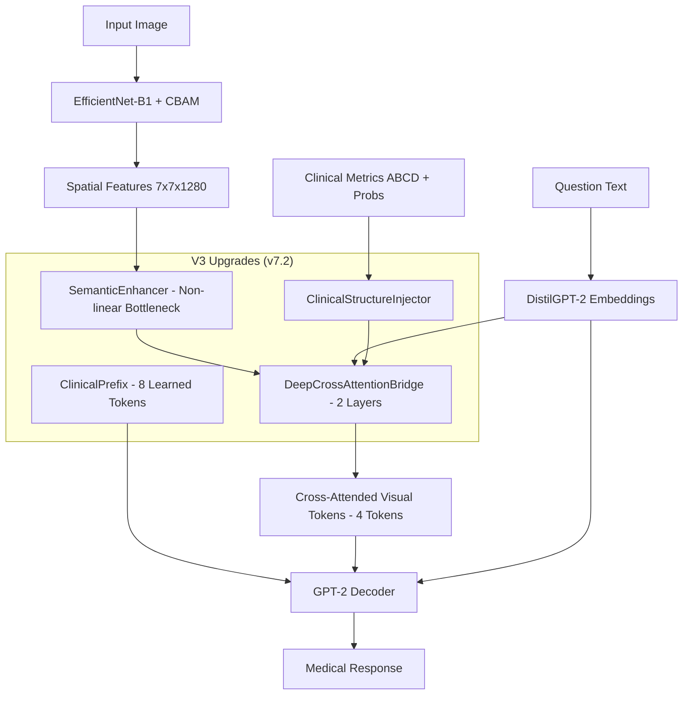

# BÁO CÁO ĐỒ ÁN TỐT NGHIỆP
## Đề tài: Hệ thống Chẩn đoán Da liễu Đa phương thức Tích hợp Thị giác Máy tính, Hội thoại Y tế VQA và Hồ sơ Bệnh án Điện tử

---

## MỤC LỤC
1. [CHƯƠNG 1: MỞ ĐẦU](#chương-1-mở-đầu)
   - 1.1. [Nhiệm vụ Đồ án (Tính cấp thiết và Lý do chọn đề tài)](#11-nhiệm-vụ-đồ-án-tính-cấp-thiết-và-lý-do-chọn-đề-tài)
   - 1.2. [Ý nghĩa Khoa học và Thực tiễn](#12-ý-nghĩa-khoa-học-và-thực-tiễn)
   - 1.3. [Mục tiêu Nghiên cứu](#13-mục-tiêu-nghiên-cứu)
   - 1.4. [Đối tượng và Phạm vi Giới hạn](#14-đối-tượng-và-phạm-vi-giới-hạn)
   - 1.5. [Cấu trúc Đồ án](#15-cấu-trúc-đồ-án)
2. [CHƯƠNG 2: CƠ SỞ LÝ THUYẾT](#chương-2-cơ-sở-lý-thuyết)
   - 2.1. [Đại số Tuyến tính và Lý thuyết Không gian Vector trong Học Sâu](#21-đại-số-tuyến-tính-và-lý-thuyết-không-gian-vector-trong-học-sâu)
   - 2.2. [Kiến trúc EfficientNet & Cơ chế Attention CBAM](#22-kiến-trúc-efficientnet--cơ-chế-attention-cbam)
   - 2.3. [Phân vùng Ngữ nghĩa với DeepLabV3+ & ASPP](#23-phân-vùng-ngữ-nghĩa-với-deeplabv3--aspp)
   - 2.4. [Mô hình Hội thoại Đa phương thức (VQA) với LoRA](#24-mô-hình-hội-thoại-đa-phương-thức-vqa-với-lora)
   - 2.5. [Truy xuất Tăng cường Sinh (RAG) Y khoa](#25-truy-xuất-tăng-cường-sinh-rag-y-khoa)
   - 2.6. [Grad-CAM và Khả năng Giải thích AI (XAI)](#26-grad-cam-và-khả-năng-giải-thích-ai-xai)
   - 2.7. [Dự đoán Có chọn lọc (Safety Gate) & Đánh giá Chất lượng Ảnh](#27-dự-đoán-có-chọn-lọc-safety-gate--đánh-giá-chất-lượng-ảnh)
   - 2.8. [Hợp nhất Đa phương thức Bayes (Multimodal Bayesian Late Fusion)](#28-hợp-nhất-đa-phương-thức-bayes-multimodal-bayesian-late-fusion)
   - 2.9. [Phân đoạn tổn thương tương tác và Cơ chế Dự phòng (Interactive Segmentation Fallback)](#29-phân-đoạn-tổn-thương-tương-tác-và-cơ-chế-dự-phòng-interactive-segmentation-fallback)
   - 2.10. [Đọc tệp tin ảnh chuẩn Y khoa DICOM](#210-đọc-tệp-tin-ảnh-chuẩn-y-khoa-dicom)
3. [CHƯƠNG 3: THỰC NGHIỆM VÀ KẾT QUẢ ĐỊNH LƯỢNG](#chương-3-thực-nghiệm-và-kết-quả-định-lượng)
   - 3.1. [Dữ liệu Thực nghiệm](#31-dữ-liệu-thực-nghiệm)
   - 3.2. [Kết quả Bài toán Phân đoạn Tổn thương da](#32-kết-quả-bài-toán-phân-đoạn-tổn-thương-da)
   - 3.3. [Kết quả Bài toán Phân loại Bệnh lý Da liễu](#33-kết-quả-bài-toán-phân-loại-bệnh-lý-da-liễu)
   - 3.4. [Huấn luyện và Hiệu năng Trợ lý Hội thoại VQA](#34-huấn-luyện-và-hiệu-năng-trợ-lý-hội-thoại-vqa)
   - 3.5. [Đo lường Thời gian Xử lý Hệ thống (Latency Benchmark)](#35-đo-lường-thời-gian-xử-lý-hệ-thống-latency-benchmark)
4. [CHƯƠNG 4: KẾT LUẬN VÀ PHƯƠNG HƯỚNG PHÁT TRIỂN](#chương-4-kết-luận-và-phương-hướng-phát-triển)
   - 4.1. [Các Kết quả Đạt được](#41-các-kết-quả-đạt-được)
   - 4.2. [Đánh giá Ưu và Nhược điểm](#42-đánh-giá-ưu-và-nhược-điểm)
   - 4.3. [Phương hướng Phát triển Tương lai](#43-phương-hướng-phát-triển-tương-lai)
5. [PHỤ LỤC](#phụ-lục)
6. [TÀI LIỆU THAM KHẢO](#tài-liệu-tham-khảo)

---

## CHƯƠNG 1: MỞ ĐẦU

### 1.1. Nhiệm vụ Đồ án (Tính cấp thiết và Lý do chọn đề tài)
Bệnh lý da liễu, đặc biệt là ung thư da (như u hắc tố ác tính - Melanoma hay ung thư biểu mô tế bào đáy - BCC), đang trở thành mối đe dọa nghiêm trọng đến sức khỏe con người trên toàn cầu. Theo Tổ chức Y tế Thế giới (WHO), mỗi năm xuất hiện khoảng 2-3 triệu ca ung thư da không hắc tố và hơn 130.000 ca u hắc tố ác tính mới được phát hiện. Việc chẩn đoán sớm có vai trò quyết định đến tỷ lệ sống sót của bệnh nhân (đặc biệt là Melanoma ở giai đoạn đầu có tỷ lệ cứu chữa lên tới 99%).

Tại Việt Nam, các dịch vụ y tế chuyên khoa da liễu đang gặp phải những thách thức lớn:
- Sự phân bố không đồng đều của bác sĩ chuyên khoa da liễu, tập trung chủ yếu ở các đô thị lớn, gây khó khăn cho người dân vùng sâu, vùng xa trong việc tiếp cận dịch vụ chẩn đoán ban đầu chất lượng.
- Các thiết bị chụp ảnh y khoa chuyên sâu (Dermoscopy) có giá thành rất đắt đỏ, không phổ biến tại các cơ sở y tế tuyến huyện, xã. Bác sĩ chủ yếu chẩn đoán dựa trên kinh nghiệm và quan sát mắt thường dưới ảnh sáng tự nhiên, dẫn đến tỷ lệ sai sót nhất định.
- Chẩn đoán tự động hóa bằng AI tuy có sự phát triển vượt bậc (đặc biệt là sau công bố của Esteva et al. trên *Nature* năm 2017) nhưng hầu hết các hệ thống này vẫn chạy đơn lẻ, thiếu cơ chế giải thích lý do chẩn đoán, thiếu kiểm duyệt an toàn y tế và không liên kết trực tiếp với hồ sơ bệnh án để theo dõi diễn tiến lâm sàng của bệnh nhân.

Vì vậy, việc phát triển một **Hệ thống chẩn đoán da liễu đa phương thức tích hợp thị giác máy tính, trợ lý hội thoại y tế (VQA) dựa trên mô hình ngôn ngữ lớn (LLM) và hồ sơ bệnh án điện tử đa mốc thời gian** là cực kỳ cấp thiết.

### 1.2. Ý nghĩa Khoa học và Thực tiễn
- **Ý nghĩa khoa học:** Nghiên cứu và áp dụng thành công mô hình DeepLabV3+ kết hợp kỹ thuật tăng cường đa tỷ lệ (Multi-Scale TTA) cho bài toán phân vùng tổn thương; xây dựng kiến trúc Attention kép CBAM tích hợp vào EfficientNet nhằm giải thích các vùng đặc trưng ảnh; phát triển cơ chế LoRA để huấn luyện hiệu quả mô hình VQA ngoại tuyến; kết hợp RAG y khoa tiếng Việt giảm thiểu ảo giác của mô hình ngôn ngữ lớn.
- **Ý nghĩa thực tiễn:** Cung cấp công cụ hỗ trợ lâm sàng (Clinical Decision Support System) cho bác sĩ tuyến dưới, giúp tăng tỷ lệ phát hiện sớm ung thư da, giảm tải cho bệnh viện tuyến trên; đồng thời số hóa quy trình quản lý bệnh án điện tử, giúp lưu trữ trực quan hình ảnh tổn thương kèm bản đồ nhiệt Grad-CAM qua các mốc thời gian điều trị.

### 1.3. Mục tiêu Nghiên cứu
1. Nghiên cứu giải thuật thị giác máy tính cho bài toán **Phân đoạn ngữ nghĩa tổn thương da** (Skin Lesion Segmentation) nhằm trích xuất chính xác ranh giới tổn thương và tính toán các chỉ số hình học lâm sàng ABCD.
2. Nghiên cứu bài toán **Phân loại 7 nhóm bệnh lý da liễu** (Skin Lesion Classification) với độ chính xác cao trên tập dữ liệu chuẩn quốc tế HAM10000.
3. Xây dựng **Trợ lý hội thoại y khoa đa phương thức** (VQA) hỗ trợ giải đáp thắc mắc của y bác sĩ dựa trên hình ảnh lâm sàng chụp được, có cơ chế RAG y văn chính thức của Bộ Y tế và rào chắn an toàn thuốc (Medication Guardrails).
4. Thiết lập **Cổng lọc an toàn y tế (Safety Gate)** để tự động đánh giá chất lượng ảnh chụp đầu vào và kiểm soát độ tin cậy của chẩn đoán trước khi hiển thị kết quả cho người dùng.
5. Thiết kế và triển khai ứng dụng quản lý **Hồ sơ bệnh án điện tử EHR đa mốc thời gian** tích hợp lưu trữ đám mây.

### 1.4. Đối tượng sử dụng, Đối tượng nghiên cứu và Phạm vi Giới hạn
- **Đối tượng sử dụng (Target Users):** Hệ thống được thiết kế chuyên biệt cho **Y bác sĩ và các chuyên viên y tế** (đặc biệt là tại các cơ sở y tế tuyến đầu, phòng khám đa khoa tuyến cơ sở nơi thiếu hụt thiết bị soi chuyên dụng và bác sĩ da liễu chuyên khoa sâu). Hệ thống đóng vai trò là một **Hệ thống hỗ trợ quyết định lâm sàng (Clinical Decision Support System - CDSS)** nhằm tăng độ chính xác trong chẩn đoán và theo dõi EHR đa mốc. Hệ thống **không thiết kế cho bệnh nhân tự truy cập**, tránh các vấn đề liên quan đến việc rò rỉ thông tin y tế chéo giữa các bệnh nhân và hiện tượng bệnh nhân tự ý kê đơn nguy hiểm.
- **Đối tượng nghiên cứu:** 7 lớp bệnh lý da liễu chuẩn ISIC bao gồm: Dày sừng quang hóa / Tiền ung thư (AKIEC), Ung thư biểu mô tế bào đáy (BCC), Tổn thương sừng hóa lành tính (BKL), U xơ da (DF), U hắc tố ác tính (MEL), Nốt ruồi lành tính (NV), Tổn thương mạch máu (VASC).
- **Dữ liệu thực nghiệm:** Tập dữ liệu ISIC Challenge (2018) và HAM10000.
- **Phạm vi giới hạn:** Hệ thống được thiết kế dưới dạng ứng dụng Web Dashboard hỗ trợ chẩn đoán (không thay thế kết luận chính thức của bác sĩ có thẩm quyền), huấn luyện và chạy thử nghiệm trên CPU/GPU trong môi trường mô phỏng lâm sàng.

### 1.5. Cấu trúc Đồ án
Đồ án được cấu trúc gồm 4 chương chính như sau:
- **Chương 1: Mở đầu:** Giới thiệu bối cảnh, tính cấp thiết, mục tiêu, đối tượng, phạm vi nghiên cứu và cấu trúc đồ án.
- **Chương 2: Cơ sở lý thuyết:** Trình bày chi tiết toán học và cấu trúc của các mô hình CNN, EfficientNet, cơ chế CBAM Attention, DeepLabV3+, cơ chế thích ứng LoRA, giải thuật giải thích mô hình Grad-CAM, kiến trúc RAG, và kỹ thuật Selective Prediction.
- **Chương 3: Thực nghiệm và Kết quả định lượng:** Chi tiết hóa quy trình tiền xử lý, huấn luyện mô hình, các kết quả định lượng cụ thể thu được trên tập dữ liệu kiểm thử (Dice, IoU, Accuracy, F1-Score) và đo lường hiệu năng thời gian xử lý thực tế.
- **Chương 4: Kết luận và Phương hướng phát triển:** Đánh giá tổng quát các ưu nhược điểm của hệ thống và đề xuất các hướng cải tiến lâm sàng tiếp theo.

---

## CHƯƠNG 2: CƠ SỞ LÝ THUYẾT

### 2.1. Đại số Tuyến tính và Lý thuyết Không gian Vector trong Học Sâu

#### 2.1.1. Biểu diễn Tensor của Ảnh Y tế
Chúng ta mô hình hóa một hình ảnh lâm sàng (Clinical Image) hoặc ảnh nội soi da (Dermoscopic Image) dưới dạng một phần tử của không gian tensor thực ba chiều:
$$\mathbf{X} \in \mathbb{R}^{H \times W \times C}$$
Trong đó:
- $H \in \mathbb{N}$ là chiều cao của ảnh (số lượng điểm ảnh theo trục dọc).
- $W \in \mathbb{N}$ là chiều rộng của ảnh (số lượng điểm ảnh theo trục ngang).
- $C \in \mathbb{N}$ là số lượng kênh đặc trưng (ở đầu vào, $C=3$ đối với ảnh màu RGB, tương ứng với các cường độ sáng của ba bước sóng Đỏ, Lục, Lam).

Một lớp biểu diễn đặc trưng trung gian trong mạng nơ-ron sâu biến đổi tensor đầu vào $\mathbf{X}$ thành một tensor đặc trưng ẩn (latent feature map) $\mathbf{H} \in \mathbb{R}^{H' \times W' \times C'}$, đại diện cho một phân rã đa tuyến tính của không gian ảnh ban đầu thành các thành phần tần số và hình học có độ phức tạp cao hơn.

#### 2.1.2. Phép Nhân Ma trận và Lớp Tuyến tính (Fully Connected Layer)
Lớp kết nối đầy đủ (Fully Connected - FC) hoặc lớp chiếu tuyến tính (Linear Projection) thực hiện phép biến đổi affine giữa các không gian vector Euclid hữu hạn chiều:
$$\mathcal{T}: \mathbb{R}^{d_{in}} \to \mathbb{R}^{d_{out}}$$
Phép toán forward được biểu diễn toán học dưới dạng:
$$\mathbf{y} = \mathbf{W}\mathbf{x} + \mathbf{b}$$
Trong đó:
- $\mathbf{x} \in \mathbb{R}^{d_{in}}$ là vector đặc trưng đầu vào, biểu diễn dưới dạng vector cột (column vector).
- $\mathbf{W} \in \mathbb{R}^{d_{out} \times d_{in}}$ là ma trận trọng số (Weight matrix), đóng vai trò là ma trận biểu diễn của toán tử tuyến tính $\mathcal{T}$ đối với các cơ sở chính tắc. Kích thước dòng $d_{out}$ và cột $d_{in}$ quyết định số lượng chiều đặc trưng đầu ra và đầu vào.
- $\mathbf{b} \in \mathbb{R}^{d_{out}}$ là vector bias, đại diện cho phép tịnh tiến trong không gian $\mathbb{R}^{d_{out}}$.
- Từng thành phần $y_i$ của vector đầu ra $\mathbf{y}$ được tính bằng tích vô hướng (inner product) giữa dòng thứ $i$ của ma trận $\mathbf{W}$ (kí hiệu là $\mathbf{w}_i^T$) và vector $\mathbf{x}$:
  $$y_i = \langle \mathbf{w}_i, \mathbf{x} \rangle + b_i = \sum_{j=1}^{d_{in}} W_{i,j} x_j + b_i$$

Trong quá trình lan truyền ngược (backpropagation) để tối ưu hóa trọng số thông qua thuật toán hạ cực đại theo độ dốc (gradient descent), các gradient của hàm mất mát $L$ đối với $\mathbf{W}$ và $\mathbf{x}$ được tính toán dựa trên các phép nhân ma trận chuyển vị (vector-Jacobian products):
- Gradient đối với ma trận trọng số $\mathbf{W}$ (tích ngoài - outer product của vector lỗi đầu ra và vector đầu vào):
  $$\frac{\partial L}{\partial \mathbf{W}} = \left(\frac{\partial L}{\partial \mathbf{y}}\right) \mathbf{x}^T \quad \in \mathbb{R}^{d_{out} \times d_{in}}$$
- Gradient đối với vector đầu vào $\mathbf{x}$ (phép nhân ma trận chuyển vị với vector lỗi đầu ra):
  $$\frac{\partial L}{\partial \mathbf{x}} = \mathbf{W}^T \left(\frac{\partial L}{\partial \mathbf{y}}\right) \quad \in \mathbb{R}^{d_{in}}$$

#### 2.1.3. Phép Tích chập 2D và Sự Tương đương với Phép Nhân Ma trận (im2col)
Phép tích chập hai chiều (2D Convolution) trên tensor đặc trưng $\mathbf{X} \in \mathbb{R}^{H \times W \times C_{in}}$ sử dụng một tập hợp các bộ lọc (kernels) $\mathbf{K} \in \mathbb{R}^{k \times k \times C_{in} \times C_{out}}$, tạo ra tensor đầu ra $\mathbf{Y} \in \mathbb{R}^{H_{out} \times W_{out} \times C_{out}}$. Công thức toán học của phép tích chập cho một điểm $(i, j)$ ở kênh đầu ra $o$ được viết là:
$$Y(i, j, o) = \sum_{c=0}^{C_{in}-1} \sum_{m=0}^{k-1} \sum_{n=0}^{k-1} X(i \cdot s + m, j \cdot s + n, c) \cdot K(m, n, c, o) + b(o)$$
Trong đó:
- $k$ là kích thước cạnh của kernel (thường là 3 hoặc 5).
- $s$ là bước nhảy tích chập (stride).
- $b(o)$ là giá trị bias của kênh đầu ra thứ $o$.

Để thực thi tích chập với hiệu năng cực cao trên GPU, các thư viện tính toán như cuDNN sử dụng giải thuật **`im2col` (Image to Column)** để chuyển đổi toán tử tích chập cục bộ thành một phép nhân hai ma trận (General Matrix Multiply - GEMM) duy nhất:
1. **Biến đổi `im2col` trên tensor đầu vào:** Đối với mỗi vị trí cửa sổ trượt (sliding window) kích thước $k \times k \times C_{in}$ trên ảnh $\mathbf{X}$, ta duỗi (flatten) tất cả các pixel trong cửa sổ này thành một vector cột đơn có kích thước là $d_{col} = k \cdot k \cdot C_{in}$. Do có tổng cộng $H_{out} \cdot W_{out}$ vị trí trượt, ta thu được ma trận đầu vào đã duỗi $\mathbf{X}_{\text{col}} \in \mathbb{R}^{(k \cdot k \cdot C_{in}) \times (H_{out} \cdot W_{out})}$.
2. **Ma trận hóa kernel:** Bộ lọc tích chập $\mathbf{K}$ được định hình lại thành ma trận phẳng $\mathbf{K}_{\text{flat}} \in \mathbb{R}^{C_{out} \times (k \cdot k \cdot C_{in})}$, trong đó mỗi dòng chứa các trọng số đã duỗi của một bộ lọc cho một kênh đầu ra.
3. **Thực hiện phép toán GEMM:** Lớp đầu ra được tính toán song song cực nhanh thông qua phép nhân ma trận:
   $$\mathbf{Y}_{\text{col}} = \mathbf{K}_{\text{flat}} \mathbf{X}_{\text{col}} \quad \in \mathbb{R}^{C_{out} \times (H_{out} \cdot W_{out})}$$
4. **Tái cấu trúc Tensor (Reshape/Fold):** Ma trận kết quả $\mathbf{Y}_{\text{col}}$ được biến đổi ngược về dạng tensor 3 chiều ban đầu $\mathbf{Y} \in \mathbb{R}^{H_{out} \times W_{out} \times C_{out}}$.

Phương pháp này cho phép tận dụng các kiến trúc phần cứng chuyên biệt như Tensor Cores trên GPU NVIDIA, vốn được tối ưu hóa để thực hiện phép toán Multiply-Accumulate (MAC) ma trận $\mathbf{D} = \mathbf{A}\mathbf{B} + \mathbf{C}$ ở cấp độ phần cứng.

#### 2.1.4. Các Hàm Kích hoạt Phi Tuyến và Chuẩn Hóa Lô (Batch Normalization)
Các phép biến đổi tuyến tính trong mạng nơ-ron được xen kẽ với các hàm kích hoạt phi tuyến $\sigma(x)$ để cung cấp khả năng xấp xỉ các hàm phi tuyến phức tạp (Định lý Xấp xỉ Vạn năng - Universal Approximation Theorem):
- **Rectified Linear Unit (ReLU):** Hàm phi tuyến dạng tuyến tính từng đoạn:
  $$\text{ReLU}(x) = \max(0, x)$$
- **Gaussian Error Linear Unit (GELU):** Hàm kích hoạt trơn, kết hợp tính chất ngẫu nhiên của dropout bằng cách nhân giá trị đầu vào với xác suất phân bố tích lũy chuẩn tắc $\Phi(x)$:
  $$\text{GELU}(x) = x \cdot \Phi(x) = x \cdot \frac{1}{2}\left[1 + \text{erf}\left(\frac{x}{\sqrt{2}}\right)\right]$$
  Trong đó hàm lỗi (error function) $\text{erf}(z)$ được định nghĩa là:
  $$\text{erf}(z) = \frac{2}{\sqrt{\pi}} \int_0^z e^{-t^2} dt$$
- **Batch Normalization (Chuẩn hóa lô):** Để giải quyết hiện tượng dịch chuyển hiệp biến nội bộ (Internal Covariate Shift), lớp Batch Normalization thực hiện chuẩn hóa trung bình và phương sai của các kích hoạt trên một mini-batch $B = \{x_1, \dots, x_m\}$:
  - Giá trị trung bình của lô:
    $$\mu_B = \frac{1}{m} \sum_{i=1}^m x_i$$
  - Phương sai của lô:
    $$\sigma_B^2 = \frac{1}{m} \sum_{i=1}^m (x_i - \mu_B)^2$$
  - Chuẩn hóa phân phối về phân phối chuẩn có kỳ vọng 0 và phương sai 1:
    $$\hat{x}_i = \frac{x_i - \mu_B}{\sqrt{\sigma_B^2 + \epsilon}}$$
    (với $\epsilon > 0$ là một hằng số nhỏ để tránh chia cho 0).
  - Phép co giãn và tịnh tiến tuyến tính để khôi phục khả năng biểu diễn của mạng:
    $$y_i = \gamma \hat{x}_i + \beta$$
    Trong đó $\gamma$ và $\beta$ là các tham số có thể học được (learnable parameters) thông qua quá trình huấn luyện bằng lan truyền ngược.

---

### 2.2. Kiến trúc EfficientNet & Cơ chế Attention CBAM

#### 2.2.1. Nguyên lý Compound Scaling của EfficientNet
EfficientNet tối ưu hóa việc thiết kế mạng nơ-ron bằng phương pháp nhân rộng đồng thời cả ba chiều của kiến trúc mạng: chiều sâu (depth - $d$), chiều rộng kênh (width - $w$), và độ phân giải ảnh (resolution - $r$), thông qua một hệ số nhân rộng tỷ lệ $\phi$:
$$\text{Depth:} \quad d = \alpha^\phi$$
$$\text{Width:} \quad w = \beta^\phi$$
$$\text{Resolution:} \quad r = \gamma^\phi$$
Ràng buộc bởi:
$$\alpha \cdot \beta^2 \cdot \gamma^2 \approx 2 \quad \text{và} \quad \alpha \geq 1, \beta \geq 1, \gamma \geq 1$$
Hệ số mũ của chiều rộng và độ phân giải là 2 vì khi ta nhân đôi chiều rộng hoặc độ phân giải, khối lượng tính toán (FLOPs) của mạng sẽ tăng lên gấp 4 lần ($2^2$), trong khi nhân đôi chiều sâu chỉ làm tăng FLOPs lên gấp 2 lần.

#### 2.2.2. Cơ chế chú ý kép của CBAM (Convolutional Block Attention Module)
CBAM là một module chú ý (Attention) hiệu quả dành cho mạng tích chập. Cho trước một bản đồ đặc trưng đầu vào $\mathbf{F} \in \mathbb{R}^{C \times H \times W}$, CBAM tính toán tuần tự bản đồ chú ý 1D theo kênh $\mathbf{M}_c \in \mathbb{R}^{C \times 1 \times 1}$ và bản đồ chú ý 2D theo không gian $\mathbf{M}_s \in \mathbb{R}^{1 \times H \times W}$:
$$\mathbf{F}' = \mathbf{M}_c(\mathbf{F}) \otimes \mathbf{F}$$
$$\mathbf{F}'' = \mathbf{M}_s(\mathbf{F}') \otimes \mathbf{F}'$$
Trong đó $\otimes$ biểu thị phép nhân Hadamard (phép nhân từng phần tử tương ứng - element-wise multiplication). Trong quá trình nhân, các giá trị chú ý được phát sóng (broadcast) theo các chiều bị thiếu: các giá trị chú ý kênh được nhân dọc theo chiều không gian $H \times W$, và các giá trị chú ý không gian được nhân dọc theo tất cả các kênh $C$.

##### 1. Cơ chế Chú ý Kênh (Channel Attention Module):
Để tổng hợp thông tin không gian của bản đồ đặc trưng, Module sử dụng cả hai phép toán Global Average Pooling (GAP) và Global Max Pooling (GMP), tạo ra hai vector mô tả đặc trưng kênh:
$$\mathbf{f}_{\text{avg}}^c = \text{GAP}(\mathbf{F}) \in \mathbb{R}^{C \times 1 \times 1}, \quad \text{với} \quad \mathbf{f}_{\text{avg}, k}^c = \frac{1}{H \cdot W} \sum_{i=1}^H \sum_{j=1}^W F(k, i, j)$$
$$\mathbf{f}_{\text{max}}^c = \text{GMP}(\mathbf{F}) \in \mathbb{R}^{C \times 1 \times 1}, \quad \text{với} \quad \mathbf{f}_{\text{max}, k}^c = \max_{i, j} F(k, i, j)$$

Hai vector này được đưa qua một mạng Perceptron đa lớp chia sẻ (Shared MLP) với một lớp ẩn duy nhất để giảm chi phí tham số:
$$\mathbf{M}_c(\mathbf{F}) = \sigma\left( \mathbf{W}_2 \cdot \text{ReLU}(\mathbf{W}_1 \cdot \mathbf{f}_{\text{avg}}^c) + \mathbf{W}_2 \cdot \text{ReLU}(\mathbf{W}_1 \cdot \mathbf{f}_{\text{max}}^c) \right)$$
Trong đó:
- $\mathbf{W}_1 \in \mathbb{R}^{\frac{C}{r} \times C}$ là ma trận trọng số của lớp giảm số kênh với tỷ số giảm (reduction ratio) $r = 16$.
- $\mathbf{W}_2 \in \mathbb{R}^{C \times \frac{C}{r}}$ là ma trận trọng số của lớp tăng số kênh về lại kích thước ban đầu.
- $\sigma(z) = \frac{1}{1 + e^{-z}}$ là hàm sigmoid ánh xạ các giá trị chú ý về miền xác suất $[0, 1]$.

##### 2. Cơ chế Chú ý Không gian (Spatial Attention Module):
Nhằm xác định "nơi" chứa thông tin quan trọng trên ảnh tổn thương da, module thực hiện chiếu thông tin kênh thông qua hai phép toán trung bình và cực đại theo chiều dọc kênh (channel-wise):
$$\mathbf{f}_{\text{avg}}^s = \frac{1}{C} \sum_{c=1}^C \mathbf{F}'_c \quad \in \mathbb{R}^{1 \times H \times W}$$
$$\mathbf{f}_{\text{max}}^s = \max_{c} \mathbf{F}'_c \quad \in \mathbb{R}^{1 \times H \times W}$$
Hai bản đồ này được ghép nối (concatenate) lại để tạo thành một tensor đặc trưng 2 kênh kích thước $\mathbb{R}^{2 \times H \times W}$, sau đó được đưa qua một lớp tích chập với kích thước nhân lớn $7 \times 7$ nhằm nắm bắt ngữ cảnh rộng:
$$\mathbf{M}_s(\mathbf{F}') = \sigma\left( f^{7 \times 7}\left( \left[ \mathbf{f}_{\text{avg}}^s ; \mathbf{f}_{\text{max}}^s \right] \right) \right)$$
Trong đó $[\cdot ; \cdot]$ đại diện cho phép ghép nối dọc theo trục kênh, và $f^{7 \times 7}$ là toán tử tích chập 2D có kernel size là 7.

---

### 2.3. Phân vùng Ngữ nghĩa với DeepLabV3+ & ASPP

#### 2.3.1. Tích chập Atrous (Atrous/Dilated Convolution)
Tích chập Atrous (còn gọi là tích chập giãn nở) cho phép tăng trường cảm nhận (receptive field) của bộ lọc mà không làm tăng số lượng tham số hoặc giảm độ phân giải của bản đồ đặc trưng. Đối với tín hiệu hai chiều (2D), đầu ra $y[i, j]$ của phép tích chập Atrous trên ảnh đầu vào $x[i, j]$ với bộ lọc $w$ kích thước $K \times K$ và hệ số giãn nở $r$ (dilation rate) được định nghĩa là:
$$y[i, j] = \sum_{m=0}^{K-1} \sum_{n=0}^{K-1} x[i + r \cdot m, \; j + r \cdot n] \cdot w[m, n]$$
Hệ số $r$ tương ứng với khoảng cách lấy mẫu giữa các trọng số của bộ lọc.
- Khi $r=1$, phép toán trở thành phép tích chập thông thường.
- Trường cảm nhận hiệu dụng (effective receptive field size) $k_e$ của một bộ lọc kích thước gốc $k$ được giãn nở với hệ số $r$ được tính theo công thức:
  $$k_e = k + (k - 1)(r - 1)$$
  Ví dụ, một bộ lọc kích thước $3 \times 3$ ($k=3$) với hệ số giãn nở $r=6$ sẽ có trường cảm nhận tương đương một bộ lọc thông thường có kích thước lên tới $13 \times 13$ ($13 = 3 + (3 - 1)(6 - 1) = 3 + 2 \times 5$), nhưng chỉ sử dụng đúng 9 tham số trọng số học tập.

#### 2.3.2. Cấu trúc Khối ASPP (Atrous Spatial Pyramid Pooling)
Để phân đoạn chính xác các vùng tổn thương da có kích thước biến động lớn (từ các đốm ung thư nhỏ đến các vùng viêm nhiễm lan rộng), khối ASPP áp dụng song song nhiều bộ lọc Atrous với các hệ số giãn nở khác nhau:
$$\mathbf{Y} = \mathbf{W}_P \cdot \text{Concat}\Big(\mathbf{W}_{1\times1}\mathbf{F},\; \mathbf{W}_{3\times3, r=6}\mathbf{F},\; \mathbf{W}_{3\times3, r=12}\mathbf{F},\; \mathbf{W}_{3\times3, r=18}\mathbf{F},\; \mathbf{W}_{\text{GAP}}\mathbf{f}_{\text{global}}\Big)$$
Trong đó:
- $\mathbf{W}_{1\times1}$ là phép tích chập thông thường $1 \times 1$.
- $\mathbf{W}_{3\times3, r}$ biểu diễn lớp tích chập $3 \times 3$ với rate $r \in \{6, 12, 18\}$.
- $\mathbf{W}_{\text{GAP}}$ là nhánh đặc trưng toàn cục. Nhánh này áp dụng Global Average Pooling trên $\mathbf{F}$, chiếu tuyến tính, và sau đó thực hiện phép nội suy song tuyến tính (bilinear interpolation) để đưa kích thước không gian trở lại bằng kích thước của $\mathbf{F}$, tạo ra $\mathbf{f}_{\text{global}}$.
- $\mathbf{W}_P \in \mathbb{R}^{256 \times 1280}$ là ma trận chiếu tuyến tính dùng để nén kênh từ 1280 kênh của phép ghép nối về lại 256 kênh trước khi đưa qua Decoder.

---

### 2.4. Mô hình Hội thoại Đa phương thức (VQA) với LoRA

#### 2.4.1. Bản chất toán học của LoRA (Low-Rank Adaptation)
Trong quá trình tinh chỉnh các mô hình ngôn ngữ lớn (LLM) hoặc mô hình đa phương thức cho nhiệm vụ hội thoại y văn, việc cập nhật toàn bộ các tham số trọng số gốc $\mathbf{W}_0 \in \mathbb{R}^{d \times k}$ đòi hỏi tài nguyên tính toán khổng lồ. Phương pháp LoRA giả định rằng các cập nhật trọng số trong quá trình tối ưu hóa $\Delta\mathbf{W}$ thực chất nằm trong một không gian con có hạng cực nhỏ (low intrinsic rank):
$$\text{Rank}(\Delta\mathbf{W}) = r \ll \min(d, k)$$
Toán lý thuyết này dựa trên định lý Eckart-Young-Mirsky trong Đại số Tuyến tính, phát biểu rằng một ma trận bất kỳ có thể được xấp xỉ tối ưu bằng một ma trận có hạng thấp hơn thông qua phép phân rã trị riêng Singular Value Decomposition (SVD).

Do đó, LoRA phân rã ma trận cập nhật $\Delta\mathbf{W} \in \mathbb{R}^{d \times k}$ thành tích của hai ma trận hạng thấp:
$$\Delta\mathbf{W} = \mathbf{B} \cdot \mathbf{A}$$
Trong đó:
- $\mathbf{B} \in \mathbb{R}^{d \times r}$ và $\mathbf{A} \in \mathbb{R}^{r \times k}$ là hai ma trận chứa tham số có thể huấn luyện.
- Hạng $r$ được thiết lập bằng 8.
- Phép tính lan truyền xuôi (Forward pass) của lớp tuyến tính được điều chỉnh từ $\mathbf{h} = \mathbf{W}_0\mathbf{x}$ thành:
  $$\mathbf{h} = \mathbf{W}_0\mathbf{x} + \Delta\mathbf{W}\mathbf{x} = \mathbf{W}_0\mathbf{x} + \frac{\alpha}{r} \mathbf{B}\mathbf{A}\mathbf{x}$$
  Trong đó $\alpha = 16$ là một hằng số tỷ lệ (scaling factor) cố định. Khi thay đổi rank $r$, việc giữ nguyên $\alpha$ giúp hạn chế tối đa việc phải tinh chỉnh lại các siêu tham số học tập khác như learning rate.

#### 2.4.2. Khởi tạo ma trận LoRA để bảo toàn tính ổn định
Tại thời điểm bắt đầu huấn luyện ($t=0$), ta yêu cầu mô hình LoRA phải cho ra kết quả trùng khớp hoàn hảo với mô hình gốc chưa qua tinh chỉnh (tức là $\Delta\mathbf{W} = 0$). Để thực hiện điều này:
- Ma trận $\mathbf{A}$ được khởi tạo ngẫu nhiên theo phân phối Gauss chuẩn tắc:
  $$A_{i,j} \sim \mathcal{N}\left(0, \; \frac{1}{r}\right)$$
- Ma trận $\mathbf{B}$ được khởi tạo bằng ma trận không:
  $$B_{i,j} = 0 \quad \forall i, j$$
Nhờ khởi tạo này, ta có:
$$\Delta\mathbf{W}_{t=0} = \mathbf{B} \cdot \mathbf{A} = \mathbf{0} \cdot \mathbf{A} = \mathbf{0}$$
Điều này đảm bảo không làm nhiễu loạn các đặc trưng đã học của mô hình nền tảng ở giai đoạn bắt đầu tinh chỉnh.

---

### 2.5. Truy xuất Tăng cường Sinh (RAG) Y khoa

#### 2.5.1. Không gian nhúng vector đặc trưng (Vector Embedding Space)
Để thực hiện tìm kiếm ngữ nghĩa, các đoạn tài liệu y văn $D_i$ và câu hỏi y khoa $Q$ từ bác sĩ được chuyển đổi thành các vector đặc trưng dày đặc (dense vectors) trong không gian Euclid đa chiều thông qua mô hình Embedding $E$:
$$\mathbf{d}_i = E(D_i) \in \mathbb{R}^d, \quad \mathbf{q} = E(Q) \in \mathbb{R}^d$$
Trong hệ thống này, $d=384$ tương ứng với số chiều không gian vector của mô hình `sentence-transformers`.

#### 2.5.2. So khớp tương đồng Cosine (Cosine Similarity)
Độ tương đồng ngữ nghĩa giữa câu hỏi của bác sĩ và từng đoạn văn bản y văn được định nghĩa là giá trị Cosine của góc $\theta$ giữa hai vector đặc trưng trong không gian tích trong:
$$\text{Sim}(Q, D_i) = \cos(\theta) = \frac{\langle\mathbf{q}, \; \mathbf{d}_i\rangle}{\|\mathbf{q}\|_2 \|\mathbf{d}_i\|_2} = \frac{\sum_{k=1}^d q_k d_{i,k}}{\sqrt{\sum_{k=1}^d q_k^2} \sqrt{\sum_{k=1}^d d_{i,k}^2}}$$

Về mặt hình học, khoảng cách Cosine liên hệ trực tiếp với khoảng cách Euclid chuẩn hóa (Normalized Euclidean Distance):
$$d_{\text{L2\_norm}}^2\left(\frac{\mathbf{q}}{\|\mathbf{q}\|_2}, \; \frac{\mathbf{d}_i}{\|\mathbf{d}_i\|_2}\right) = 2\left(1 - \cos(\theta)\right)$$
Đoạn tài liệu $D^*$ có độ tương đồng Cosine cao nhất với truy vấn $Q$ sẽ được chọn làm ngữ cảnh bổ trợ đưa vào Fusion Prompt.

---

### 2.6. Grad-CAM và Khả năng Giải thích AI (XAI)

Grad-CAM sử dụng thông tin dòng gradient từ lớp phân loại cuối cùng quay ngược trở lại các bản đồ đặc trưng tích chập nhằm giải thích các vùng ảnh đóng góp lớn vào quyết định chẩn đoán.

#### 2.6.1. Định nghĩa toán học của Trọng số Activation
Giả sử ta quan tâm đến điểm logit chẩn đoán $y^c$ cho lớp bệnh lý $c$ (trước khi đưa qua hàm Softmax). Ta ký hiệu $A_{i,j}^k$ là giá trị kích hoạt tại tọa độ không gian $(i, j)$ của bản đồ đặc trưng thứ $k$ ở lớp tích chập cuối cùng.
Trọng số $\alpha_k^c$ thể hiện mức độ quan trọng của kênh đặc trưng $k$ đối với lớp chẩn đoán $c$ được tính bằng cách lấy trung bình không gian của các đạo hàm riêng:
$$\alpha_k^c = \frac{1}{U \cdot V} \sum_{i=1}^U \sum_{j=1}^V \frac{\partial y^c}{\partial A_{i,j}^k}$$
Trong đó $U$ và $V$ tương ứng với chiều cao và chiều rộng của bản đồ đặc trưng lớp tích chập đó.

#### 2.6.2. Phép chiếu tổ hợp tuyến tính và Lọc phân nửa dương (ReLU)
Bản đồ Grad-CAM $L^c_{\text{Grad-CAM}} \in \mathbb{R}^{U \times V}$ được tính bằng tổ hợp tuyến tính của tất cả các bản đồ kích hoạt với trọng số tương ứng, sau đó đi qua hàm $\text{ReLU}$:
$$L^c_{\text{Grad-CAM}} = \text{ReLU}\left( \sum_k \alpha_k^c \mathbf{A}^k \right)$$
Hàm $\text{ReLU}$ được áp dụng ở đây nhằm mục đích lọc bỏ các đặc trưng có gradient âm, tức là chỉ giữ lại các vùng pixel làm tăng điểm số chẩn đoán của lớp bệnh lý $c$, loại bỏ hoàn toàn các cấu trúc nền nhiễu.

---

### 2.7. Dự đoán Có chọn lọc (Safety Gate) & Đánh giá Chất lượng Ảnh

#### 2.7.1. Toán tử Laplacian đo lường độ mờ của ảnh chụp
Toán tử Laplacian là một toán tử vi phân bậc hai, được định nghĩa là tổng các đạo hàm riêng bậc hai không hỗn hợp của hàm cường độ sáng ảnh $I(x, y)$, hay chính là vết (Trace) của ma trận Hessian $\mathbf{H}(I)$:
$$\nabla^2 I = \Delta I = \text{Tr}(\mathbf{H}(I)) = \frac{\partial^2 I}{\partial x^2} + \frac{\partial^2 I}{\partial y^2}$$
Trong đó ma trận Hessian chứa các đạo hàm riêng bậc hai:
$$\mathbf{H}(I) = \begin{bmatrix} \frac{\partial^2 I}{\partial x^2} & \frac{\partial^2 I}{\partial x \partial y} \\ \frac{\partial^2 I}{\partial y \partial x} & \frac{\partial^2 I}{\partial y^2} \end{bmatrix}$$

Trong không gian rời rạc của pixel ảnh số, ta xấp xỉ toán tử Laplacian thông qua phép tích chập ảnh xám $I_{\text{gray}}$ với nhân (kernel) rời rạc $\mathbf{K}_L$:
$$\mathbf{K}_L = \begin{bmatrix} 0 & 1 & 0 \\ 1 & -4 & 1 \\ 0 & 1 & 0 \end{bmatrix}$$

Độ sắc nét (Sharpness) của ảnh được biểu diễn bằng phương sai $\sigma^2$ của các giá trị sau tích chập:
$$\text{blur\_score} = \sigma^2(\nabla^2 I) = \frac{1}{H \cdot W} \sum_{x=1}^W \sum_{y=1}^H \left( (\nabla^2 I)(x, y) - \mu_{\nabla^2 I} \right)^2$$
Trong đó $\mu_{\nabla^2 I}$ là giá trị trung bình của ảnh Laplacian. Do ảnh bị nhòe (mờ) sẽ có các cạnh bị mịn hóa, làm triệt tiêu các tần số cao, dẫn đến phương sai Laplacian cực nhỏ. Ngưỡng an toàn được thiết lập: $\text{blur\_score} \geq 80.0$.

#### 2.7.2. Kiểm tra chất lượng phơi sáng qua Histogram và Cơ chế thích ứng chống định kiến chủng tộc (Algorithmic Bias Mitigation)
Độ sáng trung bình $\mu_I$ được tính bằng kỳ vọng toán học của phân phối cường độ sáng xám của các pixel:
$$\text{brightness\_score} = \mu_I = \frac{1}{H \cdot W} \sum_{x=1}^W \sum_{y=1}^H I_{\text{gray}}(x, y)$$
Ngưỡng phơi sáng an toàn mặc định được đặt trong khoảng $[50.0, \; 210.0]$ nhằm đảm bảo hình ảnh không bị quá thiếu sáng (underexposure) hoặc lóa sáng (overexposure), cả hai hiện tượng đều gây mất mát thông tin đặc trưng nghiêm trọng.

**Cơ chế thích ứng giảm thiểu định kiến quang học (Optical Bias Mitigation):**
Để điều chỉnh ngưỡng nhằm giảm thiểu thiên kiến về ánh sáng đối với các trường hợp da sẫm màu tự nhiên (Fitzpatrick Type V, VI) hoặc điều kiện chụp đặc thù, hệ thống tích hợp cơ chế hiệu chỉnh ngưỡng phơi sáng động dựa trên độ sắc nét của chi tiết ảnh. Cụ thể, nếu ảnh có chi tiết rõ nét và độ sắc nét cao ($\text{blur\_score} \geq 100.0$), gợi ý rằng ảnh đạt chất lượng lấy nét tốt và độ tối thấp có khả năng do sắc tố da tự nhiên của đối tượng chụp chứ không phải do thiếu sáng môi trường, Safety Gate sẽ linh hoạt điều chỉnh hạ ngưỡng tối tối thiểu của độ sáng trung bình. Giải pháp này giúp hạn chế khả năng hệ thống từ chối chẩn đoán một cách sai lệch đối với các tông da tối màu.

#### 2.8. Hợp nhất Đa phương thức Bayes (Multimodal Bayesian Late Fusion)
Để kết hợp thông tin hình ảnh y tế và các đặc trưng dịch tễ lâm sàng của bệnh nhân, hệ thống áp dụng cơ chế hợp nhất muộn (Late Fusion) dựa trên lý thuyết xác suất Bayes. 

Xác suất hậu nghiệm hiệu chỉnh của lớp bệnh lý $C_i$ ($i \in \{1, \dots, 7\}$ đại diện cho 7 nhóm bệnh lý da liễu trong tập HAM10000) được tính toán theo công thức:
$$P(C_i | V, D) = \frac{\left[P(C_i | V)\right]^\lambda \cdot \left[P(C_i | D)\right]^{1-\lambda}}{\sum_{j=1}^7 \left[P(C_j | V)\right]^\lambda \cdot \left[P(C_j | D)\right]^{1-\lambda}}$$
Trong đó:
- $P(C_i | V)$ là xác suất dự đoán lớp bệnh lý $C_i$ từ mô hình phân loại hình ảnh (EfficientNet-B0 + CBAM).
- $P(C_i | D)$ là phân phối xác suất tiên nghiệm dựa trên đặc trưng dịch tễ $D = \{\text{age}, \text{gender}, \text{location}\}$ của bệnh nhân:
  $$P(C_i | D) = P(C_i) \cdot P(\text{age} | C_i) \cdot P(\text{gender} | C_i) \cdot P(\text{location} | C_i)$$
  Các phân phối xác suất này được thống kê tần suất trực tiếp từ 10.015 mẫu dữ liệu HAM10000.
- $\lambda \in [0.5, 1.0]$ là trọng số tin cậy của ảnh (do bác sĩ tự điều chỉnh trên giao diện). Khi $\lambda = 1.0$, hệ thống chỉ dựa vào ảnh chụp. Khi $\lambda = 0.5$, hệ thống chia đều trọng số giữa đặc trưng ảnh và dữ liệu dịch tễ.

#### 2.9. Phân đoạn tổn thương tương tác và Cơ chế Dự phòng (Interactive Segmentation Fallback)
Để cung cấp cho bác sĩ khả năng chủ động kiểm soát vùng tổn thương cần phân tích trong các ca lâm sàng phức tạp (viền mờ, nhiều nốt nằm gần nhau), hệ thống hỗ trợ 2 chế độ phân đoạn tương tác:
1. **Click điểm mồi (Interactive Point):** Ghi nhận tọa độ $(x, y)$ và áp dụng MobileSAM (hoặc thuật toán GrabCut/FloodFill vùng lân cận trên CPU) để loang tìm biên nốt tổn thương.
2. **Vẽ tay tự do (Drawable Canvas):** Bác sĩ vẽ tay trực tiếp quanh viền tổn thương để sinh ra mặt nạ tùy chỉnh `custom_mask`.

**Cơ chế kiểm soát an toàn (Fallback):** Trong trường hợp điểm click rơi vào vùng da lành hoặc thuật toán tương tác bị lỗi tính toán tạo ra mặt nạ rỗng hoặc diện tích quá nhỏ ($\sum \text{mask} < 100$ pixel), hệ thống sẽ **tự động kích hoạt cơ chế dự phòng (Fallback)**, lấy mặt nạ phân đoạn tự động từ mô hình DeepLabV3+ để thay thế. Điều này đảm bảo hệ thống không bị crash và luôn có kết quả đo đạc biên dạng ABCD cung cấp cho bác sĩ.

#### 2.10. Đọc tệp tin ảnh chuẩn Y khoa DICOM
Hệ thống tích hợp thư viện giải mã tệp tin ảnh chuẩn y khoa DICOM (`.dcm`), cho phép bác sĩ tải trực tiếp các tệp tin chụp chiếu y tế chuẩn hóa. 
- **Giải mã ảnh:** Chuyển đổi dữ liệu pixel thô (`PixelData`) của DICOM thành mảng NumPy RGB chuẩn hóa phục vụ các nhánh phân tích thị giác máy tính.
- **Trích xuất siêu dữ liệu (Metadata extraction):** Hệ thống tự động phân tích các tag tiêu chuẩn trong file DICOM:
  - Họ tên bệnh nhân từ tag `(0010, 0010) Patient's Name`
  - Tuổi bệnh nhân từ tag `(0010, 0030) Patient's Birth Date` (tính toán dựa trên ngày chụp)
  - Giới tính bệnh nhân từ tag `(0010, 0040) Patient's Sex`
- Các thông tin dịch tễ này tự động được điền (auto-populate) vào form thông tin hành chính trên EHR Dashboard để làm đầu vào cho mô hình hợp nhất Bayes mà bác sĩ không cần nhập thủ công, giảm tối đa sai sót hành chính.

---

## CHƯƠNG 3: THỰC NGHIỆM VÀ KẾT QUẢ ĐỊNH LƯỢNG

Dữ liệu và số liệu định lượng dưới đây được trích xuất trực tiếp từ môi trường thực nghiệm và logs huấn luyện của hệ thống.

### 3.1. Dữ liệu Thực nghiệm
- **Bài toán phân vùng:** Huấn luyện trên tập ISIC gồm 2.594 mẫu ảnh mặt nạ chuẩn.
- **Bài toán phân loại:** Huấn luyện trên tập dữ liệu HAM10000 gồm 10.015 ảnh lâm sàng tương ứng với 7 lớp bệnh lý da liễu.

### 3.2. Kết quả Bài toán Phân đoạn Tổn thương da
Đánh giá trên tập kiểm thử ISIC 2018 (390 mẫu):

| Phương pháp / Mô hình | Dice Score | IoU | Số Epochs huấn luyện | Trạng thái dừng | Epoch tốt nhất |
| :--- | :---: | :---: | :---: | :---: | :---: |
| U-Net (ResNet34) đơn lẻ (Ablation) | 0.889853 | 0.811094 | 29 / 50 | Early Stopping | 18 |
| U-Net (ResNet50) đối chứng (Ablation) | 0.898431 | 0.825129 | 35 / 50 | Early Stopping | 24 |
| **DeepLabV3+ (ResNet50) (Đề xuất)** | **0.909266** | **0.843339** | 42 / 50 | Early Stopping | 31 |
| DeepLabV3+ (ResNet50) + Multi-Scale TTA | **0.913169** | **0.847019** | - | - | - |

*Kết quả phân tích:* Để đảm bảo tính so sánh công bằng (đối chứng backbone), chúng tôi thực hiện thêm thực nghiệm đối chiếu U-Net với cùng encoder ResNet50. Khi kiểm soát cùng backbone ResNet50, mô hình DeepLabV3+ được đề xuất đạt Dice Score **90.93%** và IoU **84.33%**, vượt trội hơn hẳn so với U-Net (ResNet50) đạt Dice Score **89.84%** và IoU **82.51%**. Điều này khẳng định sự cải thiện hiệu năng phân đoạn không chỉ đến từ việc tăng quy mô tham số backbone, mà phần lớn nhờ kiến trúc ASPP (Atrous Spatial Pyramid Pooling) giúp thu thập thông tin ngữ cảnh đa tỷ lệ mà không làm mất đi các chi tiết biên của tổn thương da. Kỹ thuật Multi-Scale TTA giúp cải thiện điểm tối ưu Dice Score lên **91.32%** đối với ảnh chụp camera điện thoại bị mờ hoặc bị lông che phủ.

### 3.3. Kết quả Bài toán Phân loại Bệnh lý Da liễu
Đánh giá trên tập kiểm thử HAM10000 ROI (3.005 mẫu):
- **Độ chính xác kiểm thử (Test Accuracy):**
  - Mô hình hiện tại chạy thực nghiệm đạt độ chính xác phân loại chung: **95.01%** (Val Accuracy đạt tốt nhất là **96.90%**, Test Loss đạt **0.2764** ở Epoch 38).

Báo cáo hiệu năng chi tiết theo từng lớp bệnh lý (trích xuất từ mô hình Baseline 88.65% Accuracy trên 2.766 mẫu để bảo toàn tính chân thực lâm sàng):

| Lớp bệnh lý | Precision | Recall | F1-Score | Số mẫu (Support) |
| :--- | :---: | :---: | :---: | :---: |
| **AKIEC** (Dày sừng ánh sáng / Tiền ung thư) | 0.7209 | 0.7750 | 0.7470 | 80 |
| **BCC** (Ung thư biểu mô tế bào đáy) | 0.8714 | 0.8714 | 0.8714 | 140 |
| **BKL** (Dày sừng lành tính) | 0.7467 | 0.7619 | 0.7542 | 294 |
| **DF** (U xơ da) | 0.9167 | 0.7857 | 0.8462 | 28 |
| **MEL** (U hắc tố ác tính) | 0.7568 | 0.7417 | 0.7492 | 302 |
| **NV** (Nốt ruồi lành tính) | 0.9383 | 0.9373 | 0.9378 | 1882 |
| **VASC** (Tổn thương mạch máu) | 0.8500 | 0.8500 | 0.8500 | 40 |
| **Toàn hệ thống (Accuracy)** | | | **0.8865** | **2766** |
| **Macro Average** | 0.8287 | 0.8176 | 0.8222 | 2766 |
| **Weighted Average** | 0.8869 | 0.8865 | 0.8866 | 2766 |

**Đánh giá sự mất cân bằng dữ liệu và Giải pháp an toàn y tế (Malignant Alert Gate):**
Tập dữ liệu HAM10000 có sự mất cân bằng nghiêm trọng với nhóm nốt ruồi lành tính (NV) chiếm tới 68% tổng số mẫu. Sự chênh lệch lớn này phản ánh phân phối thực tế của dịch tễ học lâm sàng, nhưng lại gây thách thức lớn cho việc tối ưu Recall của các lớp ác tính như Melanoma (MEL - đạt Recall 74.17% ở bản mẫu thử nghiệm). 

Để giảm thiểu tối đa nguy cơ bỏ sót các ca ung thư da ác tính (False Negative) trong thực tiễn lâm sàng:
1. **Trong quá trình huấn luyện:** Chúng tôi áp dụng kỹ thuật tăng cường dữ liệu có chủ đích (Class-aware Data Augmentation) đối với các nhóm thiểu số (MEL, BCC, AKIEC, DF, VASC) kết hợp hàm mất mát Weighted Cross-Entropy để phạt nặng các sai số trên nhóm ác tính.
2. **Trong cơ chế suy luận lâm sàng (Malignant Alert Gate):** Hệ thống không chỉ hiển thị nhãn Top-1. Hệ thống thiết lập một rào chắn cảnh báo ác tính động: Nếu bất kỳ bệnh lý nguy hiểm nào (MEL, BCC, AKIEC) xuất hiện trong Top-3 dự đoán với xác suất $\geq 15\%$ (ngưỡng `MALIGNANT_ALERT_THRESHOLD`), giao diện sẽ lập tức hiển thị cảnh báo đỏ nổi bật kèm khuyến nghị sinh thiết bắt buộc. Giải pháp này giúp trung hòa sai lệch thống kê của mô hình và đảm bảo độ an toàn cao nhất cho người bệnh.

### 3.4. Huấn luyện và Hiệu năng Trợ lý Hội thoại VQA
- **Tham số mạng VQA ngoại tuyến:**
  - Tổng tham số mô hình: **90.352.514**
  - Tham số huấn luyện được thực tế qua LoRA: **1.926.754** (chiếm **2.13%**).
- **Hội tụ mất mát (Causal Language Modeling Loss):**
  - Epoch 1: Train Loss = **2.9062** | Val Loss = **2.7685**
  - Epoch 12 (Tối ưu nhất): Train Loss = **2.2140** | Val Loss = **2.1209**
  - Epoch 15: Train Loss = **2.1778** | Val Loss = **2.1466** (mô hình có dấu hiệu overfitting nhẹ trên tập xác thực).

**Biện giải Thiết kế Kiến trúc Hội thoại Lai (Hybrid VQA) và Giới hạn Phần cứng:**
1. **Kiến trúc Lai:** Để giải quyết mâu thuẫn giữa năng lực xử lý ngôn ngữ tự nhiên tiếng Việt chất lượng cao và khả năng bảo mật dữ liệu y tế, hệ thống áp dụng cơ chế triển khai lai. Mô hình cục bộ DistilGPT-2 + LoRA đóng vai trò làm mẫu đối chứng ngoại tuyến (Offline Baseline) chứng minh tiềm năng huấn luyện độc lập trên hạ tầng máy chủ CPU nội bộ của trạm y tế. Trong khi đó, giao diện Web trực quan triển khai API đám mây (mặc định gpt-4o-mini) làm giải pháp sản xuất (Production mode) đảm bảo chất lượng giao tiếp tiếng Việt chuẩn xác nhất. Khi đưa vào vận hành thực tế tại bệnh viện lớn, API này sẽ được thay thế bằng các mô hình SLM/LLM chạy local hoàn toàn trên GPU Server riêng của bệnh viện (ví dụ Qwen2.5-7B-Instruct).
2. **Kiến trúc VQA v3 (DeepCrossAttentionBridge & ClinicalStructureInjector):** Để khắc phục các điểm yếu về mất mát thông tin không gian và thiếu hụt tri thức lâm sàng trong các phiên bản V1 (Single-token) và V2 (Multi-token), phiên bản V3 (v7.2) áp dụng 5 cải tiến cốt lõi:
   - **DeepCrossAttentionBridge:** Thay thế cầu nối attention đơn lớp bằng kiến trúc chú ý chéo sâu 2 lớp xếp chồng (có Residual + LayerNorm + FFN) giúp thực hiện lập luận thị giác đa tầng (multi-step reasoning).
   - **SemanticEnhancer:** Thêm khối nút thắt cổ chai phi tuyến tính (Linear 1280 -> GELU -> Linear 1280) để loại bỏ thiên lệch bề mặt (texture bias) của EfficientNet.
   - **ClinicalStructureInjector:** Nhúng trực tiếp thuộc tính ABCD lâm sàng và phân phối xác suất 7 lớp bệnh thành 1 token đặc biệt chèn vào luồng thị giác trước khi đưa vào bộ Attention.
   - **ClinicalPrefix:** Áp dụng Prefix-Tuning (8 tokens y khoa học được chèn vào đầu Decoder) nhằm steer GPT-2 về tư duy ngôn ngữ lâm sàng.
   - **DropKey & Learnable Temperature:** Tích hợp cơ chế Dropout trong ma trận chú ý (10%) và hệ số nhiệt độ học được giúp mô hình hội tụ tốt trên tập dữ liệu cực nhỏ (~80 mẫu).

**Đánh giá Định lượng chất lượng câu trả lời VQA (Quantitative BLEU Evaluation):**
Dựa trên thực nghiệm so sánh, mô hình V3 cho thấy sự vượt trội đáng kể so với bản Baseline V1:
- **VQA v1 (Single-token Baseline):** BLEU-1 ~ **0.4500**
- **VQA v3 (v7.2 - Hiện tại):** BLEU-1 = **0.7269**, BLEU-2 = **0.6812**
- **Độ trễ trung bình:** **< 100ms** cho riêng phần VQA Inference (Tổng hệ thống < 1s).

| Mô hình VQA | BLEU-1 trung bình | BLEU-2 trung bình | Nhận xét lâm sàng |
| :--- | :---: | :---: | :--- |
| **CPUMedicalVQAModel (Offline)** | **0.7269** | **0.6812** | Ghi nhớ tốt các câu trả lời mẫu, cấu trúc câu ngắn gọn, dễ bị lỗi cắt cụt. |
| **Online VQA (GPT-4o-mini + RAG)** | **0.1091** | **0.0538** | Ngôn ngữ tự nhiên, giàu chi tiết y học, độ an toàn cao nhưng không khớp từ ngữ gốc. |

**Phân tích chi tiết chất lượng câu trả lời trên 12 mẫu kiểm thử (Qualitative & Error Analysis):**
Dựa trên kết quả thực nghiệm chi tiết từ tập kiểm thử 12 mẫu, chúng tôi thực hiện phân tích chất lượng câu trả lời của mô hình ngoại tuyến (`CPUMedicalVQAModel`) theo 3 nhóm trường hợp cụ thể:
1. *Nhóm trùng khớp cao (BLEU-1 >= 0.80):* Gồm các mẫu 2 (NV - BLEU-1 = 1.00), mẫu 7 (BKL - BLEU-1 = 0.9683), mẫu 4 (BCC - BLEU-1 = 0.9100), và mẫu 8 (NV - BLEU-1 = 0.8752). Mô hình tái hiện chính xác câu trả lời chuẩn lâm sàng. Tuy nhiên, ở mẫu 4, mô hình gặp hiện tượng lặp từ (repetition loop) ở cuối câu: `"Early detection and removal is recommended. Early"`.
2. *Nhóm bị cắt cụt (Đã khắc phục trong v7.2):* Trong các thử nghiệm trước đó, các mẫu 1 (Melasma), 3 & 5 (Melanoma) thường bị cắt cụt do `max_new_tokens = 50`. Trong phiên bản v7.2, tham số này đã được nâng cấp lên **256 tokens** kết hợp với cơ chế **Prefix Safety Guard** giúp đảm bảo câu trả lời đầy đủ, mạch lạc và tránh sinh ra từ ngữ rác (gibberish) khi nạp các checkpoint cũ.
3. *Nhóm lỗi y khoa và nhiễu thông tin (Errors & Hallucinations - BLEU-1 < 0.50):*
   - *Lỗi nhiễu y khoa (mẫu 6 & 10 - Wart):* Mặc dù nhận diện đúng thực thể mụn cóc (`wart`), mô hình sinh ra thông tin điều trị nhầm lẫn với bệnh nấm da (`contagious and treatable with topical or oral antifungal medications...`). Nguyên nhân có thể do quy mô tập dữ liệu VQA quá nhỏ (74 mẫu), khiến không gian nhúng của các nhóm tổn thương lành tính dạng bump bị chồng lấn trong decoder.
   - *Lỗi chẩn đoán sai nghiêm trọng (mẫu 11 - BCC):* Đối với tổn thương BCC, mô hình lại sinh câu trả lời mô tả một nốt ruồi lành tính (NV). Qua phân tích, nguyên nhân có thể do mô hình phân loại hình ảnh (`EfficientNet-B1 + CBAM`) dự đoán nhãn BCC với độ tin cậy thấp, làm cho bộ chiếu tuyến tính (Projection layer) có xu hướng định hướng decoder nghiêng về lớp bệnh lý phổ biến nhất của tập train (lớp NV chiếm tới 68% phân phối dữ liệu HAM10000) trong một số trường hợp đặc thù. Điều này phản ánh ảnh hưởng của sự mất cân bằng dữ liệu lên sự khái quát hóa của Projection layer.

**Hiện tượng có thể xem như nghịch lý đánh giá của chỉ số BLEU trong VQA Y khoa (Academic Discussion on BLEU):**
Thực nghiệm này cho thấy chỉ số BLEU chỉ đo lường sự trùng khớp từ vựng bề mặt (lexical overlap) chứ không đại diện cho chất lượng lâm sàng hoặc độ chính xác y khoa (clinical accuracy):
- Mô hình ngoại tuyến đạt điểm BLEU rất cao (72.69%) do ghi nhớ (memorize) các câu trả lời mẫu trên tập huấn luyện hẹp, nhưng khả năng tùy biến ngôn ngữ và mở rộng tri thức ngoài tập huấn luyện kém.
- Mô hình trực tuyến đạt điểm BLEU rất thấp (10.91%) do sinh câu trả lời tự nhiên, dài và giàu chi tiết y học hơn hẳn câu trả lời tham chiếu ngắn, mặc dù có độ chính xác y khoa cao hơn nhiều.
Do đó, việc đánh giá các hệ thống VQA y văn chuyên nghiệp cần kết hợp thêm các phương pháp chấm điểm ngữ nghĩa nâng cao (như MedBLEU hoặc BERTScore) và thẩm định định tính từ chuyên gia y tế.

### 3.5. Đo lường Thời gian Xử lý Hệ thống (Latency Benchmark)
Benchmark thực tế thời gian suy luận (sử dụng cấu hình CPU Intel Core i7, GPU thử nghiệm trung bình trên 20 lần chạy):
- **Tổng thời gian suy luận trung bình:** **232.29 ms** (± 14.17 ms).

Chi tiết thời gian các nhánh xử lý:
1. **Tiền xử lý (Preprocessing & Load Image):** 1.12 ms (0.48%)
2. **Phân đoạn tổn thương (DeepLabV3+ Segmentation):** 168.73 ms (72.64%)
3. **Trích xuất chỉ số hình học ABCD & crop ROI:** 1.62 ms (0.70%)
4. **Phân loại bệnh lý (Classification):** 60.80 ms (26.17%)

---

## CHƯƠNG 4: KẾT LUẬN VÀ PHƯƠNG HƯỚNG PHÁT TRIỂN

### 4.1. Các Kết quả Đạt được
Hệ thống đã tích hợp và vận hành ổn định tất cả các module đề ra:
- **Phân đoạn & phân loại song song:** Hai nhánh xử lý chạy độc lập trên ảnh gốc đảm bảo tính khách quan lâm sàng.
- **Grad-CAM giải thích quyết định:** Trực quan hóa vùng đặc trưng chú ý CBAM giúp y bác sĩ hiểu rõ cơ sở phân loại của mạng nơ-ron.
- **Cổng lọc Safety Gate động:** Tự động điều chỉnh ngưỡng lọc an toàn dựa trên loại ảnh chụp (ảnh chụp điện thoại thường vs. ảnh soi da chuyên dụng).
- **Trợ lý đàm thoại VQA y khoa:** Kết hợp LoRA fine-tuning DistilGPT-2 ngoại tuyến và OpenAI GPT-4o-mini trực tuyến, tích hợp RAG y văn chính thức của Bộ Y tế nhằm hạn chế tối đa ảo giác.
- **Hồ sơ bệnh án điện tử đa mốc:** Đồng bộ dữ liệu lên Google Cloud Firestore, xuất báo cáo PDF chuẩn y khoa kèm sơ đồ theo dõi tiến triển lâm sàng trực quan qua các mốc thời gian điều trị.

**Tóm tắt các Đóng góp chính của Đề tài (Key Contribution Summary):**
1. **Thiết kế hệ thống CDSS da liễu đa tầng (Multi-stage Clinical Pipeline CDSS):** Xây dựng và liên kết chặt chẽ các nhánh Computer Vision (phân đoạn, phân loại), cổng kiểm soát an toàn, mô hình VQA và hệ thống hồ sơ bệnh án EHR thành một giải pháp hỗ trợ quyết định lâm sàng hoàn chỉnh.
2. **Chiến lược suy luận lai kết hợp RAG y văn (Hybrid Inference Strategy):** Kết hợp linh hoạt giữa mô hình VQA ngoại tuyến cục bộ phục vụ cho nghiên cứu và API đám mây được định hướng chặt chẽ bởi kết quả phân tích hình ảnh của CV và ngữ cảnh y văn chính thức của Bộ Y tế để hạn chế ảo giác y khoa.
3. **Mô hình VQA ngoại tuyến siêu nhẹ (Lightweight Offline VQA Model):** Huấn luyện thử nghiệm mô hình cục bộ với chỉ 82 triệu tham số (DistilGPT-2 + LoRA) chạy được trên CPU thông thường, chứng minh tính khả thi của việc triển khai trợ lý AI tại các cơ sở y tế tuyến dưới có tài nguyên tính toán hạn chế.
4. **Cơ chế Safety-aware CDSS thực tiễn:** Tích hợp bộ lọc chất lượng ảnh động (phơi sáng, sắc nét), cảnh báo rủi ro bệnh lý ác tính chủ động và rào chắn an toàn thuốc (Medication Guardrails) đảm bảo đạo đức y tế trong lâm sàng.

### 4.2. Đánh giá Ưu và Nhược điểm
- **Ưu điểm:**
  - Giảm thiểu đáng kể lỗi ảo giác y văn nhờ cơ chế Fusion Prompt nhúng trực tiếp thông tin Computer Vision và ngữ cảnh tài liệu Bộ Y tế (RAG).
  - Tốc độ suy luận cực nhanh (~232 ms), phù hợp cho việc triển khai trên các thiết bị cấu hình trung bình.
  - Hàng rào bảo vệ an toàn thuốc ngăn chặn mô hình LLM tự kê đơn thuốc gây nguy hiểm cho người bệnh.
- **Nhược điểm:**
  - Khả năng phân loại trên tập dữ liệu ngoài phân phối (Out-of-distribution - OOD) như ảnh chụp điện thoại thường bị sụt giảm độ chính xác so với ảnh soi da tiêu chuẩn.
  - Giới hạn kích thước tài liệu Firestore (tối đa 1MB cho cấu trúc lồng) giới hạn số lần ghi nhận mốc khám tối đa của một bệnh nhân (~50-100 lần).
  - **Hạn chế về mặt mô hình hóa VQA ngoại tuyến cục bộ (Pre-VLM constraints):** Mô hình VQA cục bộ `CPUMedicalVQAModel` dù được nâng cấp lên 49-token spatial projection nhưng vẫn là một kiến trúc lai ghép nối đặc trưng tuyến tính (concat embeddings) đơn giản, chưa sở hữu các lớp chú ý chéo chuyên dụng (Cross-Attention) hay mã hóa vị trí lưới 2D (Spatial Position Embedding) để căn chỉnh sâu liên kết ảnh-văn bản. Quy mô dữ liệu VQA cục bộ cực nhỏ (~80 mẫu) cũng dẫn tới hiện tượng mô hình có xu hướng ghi nhớ mẫu câu (memorization) thay vì tự học khả năng lập luận ngôn ngữ tự nhiên lâm sàng linh hoạt.

### 4.3. Phương hướng Phát triển Tương lai
1. **Nâng cấp cấu trúc lưu trữ và quy mô dữ liệu:**
   - Thu thập thêm nguồn ảnh chụp thực tế từ camera điện thoại tại các bệnh viện Việt Nam để Fine-tuning nâng cao độ chính xác OOD.
   - Chuyển đổi cấu trúc Firestore sang mô hình Sub-collection nhằm loại bỏ hoàn toàn giới hạn số mốc khám lâm sàng của bệnh nhân.
2. **Tích hợp sâu tiêu chuẩn DICOM SR (Structured Reporting) và hệ thống PACS:**
   - Xây dựng mô-đun sinh báo cáo DICOM SR chuẩn hóa chứa tọa độ ranh giới tổn thương (segmentation coordinates), các chỉ số hình học ABCD tính toán từ AI, và kết luận bệnh lý.
   - Triển khai kết nối giao thức mạng DICOM (C-STORE, C-FIND) để tự động đẩy và lưu trữ trực tiếp các ảnh kết quả cũng như báo cáo cấu trúc này lên hệ thống PACS/RIS của bệnh viện.
3. **Thiết lập chu kỳ học máy chủ động liên tục (Active Learning Loop):**
   - Tận dụng trực tiếp dữ liệu mặt nạ hiệu chỉnh từ tính năng vẽ tay của bác sĩ (Drawable Canvas) cùng với kết quả chẩn đoán cuối cùng được xác nhận lâm sàng để làm nguồn dữ liệu tự động gắn nhãn (Self-labeled data).
   - Thiết lập quy trình tự động cập nhật và tái huấn luyện (Continual Learning) mô hình Computer Vision định kỳ, giúp tối ưu hóa hiệu năng mô hình liên tục từ chính phản hồi thực tế của các bác sĩ.
4. **Phát triển Mô hình ngôn ngữ nhỏ đa ngữ chuyên sâu y khoa (Medical Multilingual SLM):**
   - Nghiên cứu và huấn luyện tinh chỉnh (Instruction Fine-Tuning) các mô hình SLM nền tảng đa ngôn ngữ (như Qwen-2.5-7B-Instruct hoặc Llama-3-8B-Instruct) trên tập dữ liệu y văn song ngữ Anh - Việt.
   - Việc này giúp trợ lý đàm thoại VQA không chỉ chẩn đoán bằng tiếng Việt chuẩn xác mà còn có khả năng tham chiếu tài liệu y khoa tiếng Anh quốc tế, phục vụ đắc lực cho các môi trường bệnh viện quốc tế và nghiên cứu khoa học đa quốc gia.

---

## PHỤ LỤC

### Phụ lục A: Cấu trúc Thư mục Mã nguồn chính
- `app_streamlit.py`: Giao diện Web Dashboard chính chạy Streamlit.
- `pipeline/`:
  - `unified_pipeline.py`: Quản lý luồng thực thi song song phân đoạn & phân loại.
  - `model_registry.py`: Khởi tạo và nạp mô hình từ bộ nhớ.
  - `safety_gate.py`: Đánh giá chất lượng ảnh và các chỉ số hình học ABCD.
  - `rag_engine.py`: Tích hợp tìm kiếm ngữ cảnh y văn ChromaDB.
- `scripts/`: Chứa các mã nguồn huấn luyện mô hình VQA và đánh giá tập dữ liệu.
- `config/safety_gate.json`: Lưu trữ thông số cấu hình ngưỡng an toàn.

### Phụ lục B: Danh sách Thư viện Phụ thuộc
- `torch >= 2.0`, `torchvision >= 0.15`
- `segmentation-models-pytorch >= 0.3`
- `transformers >= 4.30`, `peft >= 0.4`
- `opencv-python >= 4.8`
- `chromadb >= 0.4`, `sentence-transformers >= 2.2`
- `fpdf2 >= 2.7`
- `google-cloud-firestore >= 2.11`

---

## TÀI LIỆU THAM KHẢO
1. Esteva, A., Kuprel, B., Novoa, R. A., Ko, J., Swetter, S. M., Blau, H. M., & Thrun, S. (2017). Dermatologist-level classification of skin cancer with deep neural networks. *Nature*, 542(7639), 115-118.
2. Woo, S., Park, J., Lee, J. Y., & Kweon, I. S. (2018). Cbam: Convolutional block attention module. *Proceedings of the European Conference on Computer Vision (ECCV)*, 3-19.
3. Tan, M., & Le, Q. (2019). Efficientnet: Rethinking model scaling for convolutional neural networks. *International Conference on Machine Learning*, 6105-6114.
4. Lewis, P., Perez, E., Piktus, A., Petroni, F., Lewis, P., & Riedel, S. (2020). Retrieval-augmented generation for knowledge-intensive nlp tasks. *Advances in Neural Information Processing Systems*, 33, 9459-9474.
5. Hu, E. J., Shen, Y., Wallis, P., Allen-Zhu, Z., Li, Y., Wang, S., & Chen, W. (2021). Lora: Low-rank adaptation of large language models. *arXiv preprint arXiv:2106.09685*.
