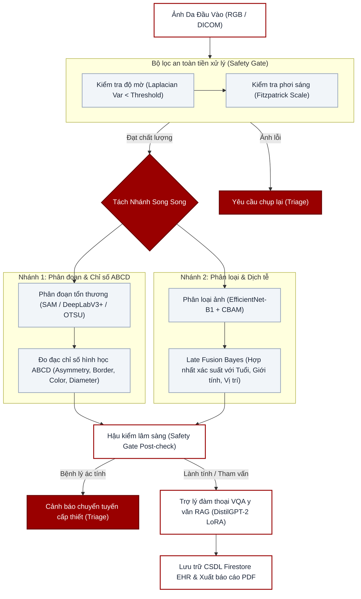
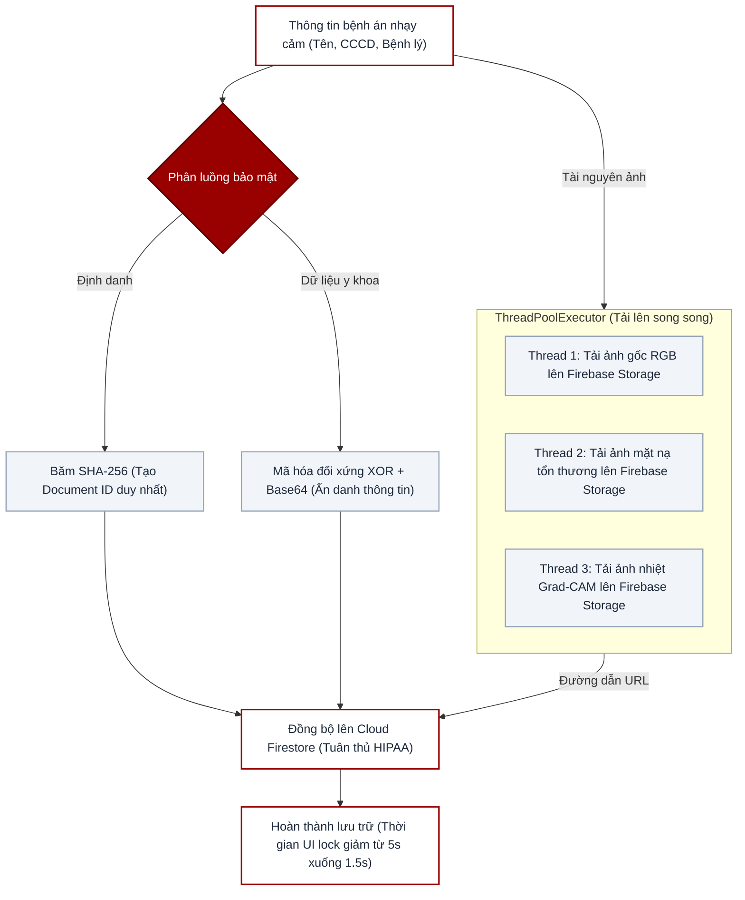
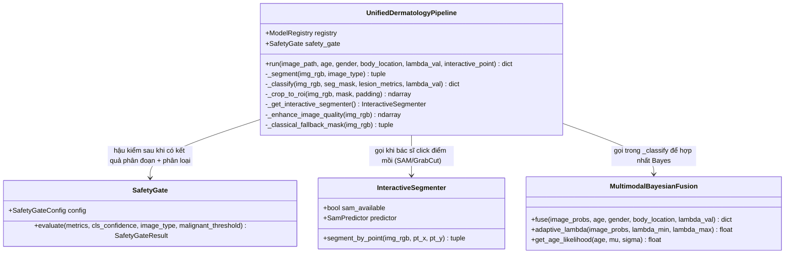
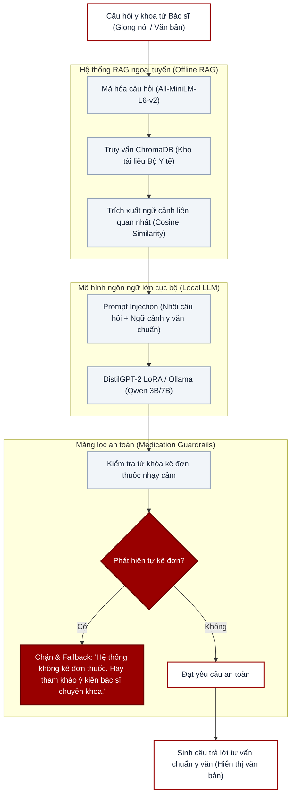
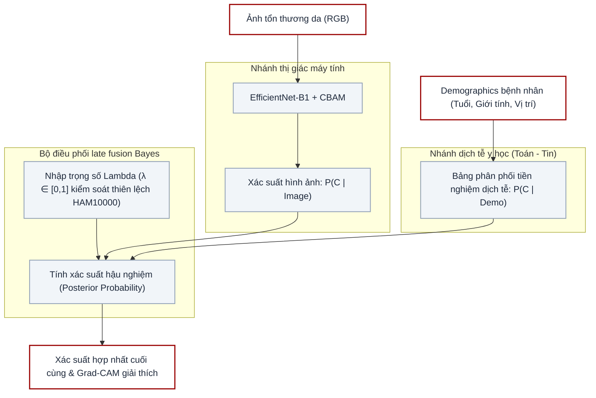

# HƯỚNG DẪN IMPORT SƠ ĐỒ MERMAID VÀO DRAW.IO (TẠO BIỂU ĐỒ VECTOR CHỈNH SỬA ĐƯỢC)

Để chuyển các sơ đồ kỹ thuật dưới đây thành dạng sơ đồ vector sắc nét, có thể tự do chỉnh sửa màu sắc, cỡ chữ trên Draw.io, bạn hãy làm theo các bước sau:

1. Truy cập trang web **[draw.io](https://app.diagrams.net/)** (hoặc mở phần mềm Draw.io trên máy tính).
2. Tạo một bản vẽ mới hoặc mở bản vẽ hiện có.
3. Trên thanh công cụ phía trên, nhấn vào biểu tượng dấu cộng **`+` (Insert)** -> chọn **`Advanced`** -> chọn **`Mermaid`**.
4. Copy toàn bộ đoạn mã Mermaid của sơ đồ tương ứng dưới đây và paste vào khung soạn thảo của Draw.io.
5. Nhấn nút **`Insert`** (hoặc **`Chèn`**). Draw.io sẽ tự động dựng thành sơ đồ vector 100% chỉnh sửa được cho bạn!

---

## 1. Sơ đồ Kiến trúc Tổng quan Hệ thống (Slide 7)
Sơ đồ mô tả luồng dữ liệu song song độc lập từ ảnh đầu vào qua Safety Gate và phân nhánh xử lý trước khi ra quyết định lâm sàng.



---

## 2. Biểu đồ Use Case Chức năng Hệ thống (Slide 8)
Biểu đồ mô tả quyền hạn và các ca sử dụng của Bác sĩ lâm sàng trực tiếp trên giao diện CDSS (không có hệ thống phân quyền phức tạp).

```mermaid
left-to-right direction
graph TD
    %% Quyết định màu sắc
    classDef actor fill:#990000,stroke:#660000,stroke-width:2px,color:#fff;
    classDef usecase fill:#fff,stroke:#990000,stroke-width:2px,color:#1e293b;

    %% Actors
    Doc(("Bác sĩ lâm sàng")):::actor

    %% Use Cases
    ConfigSG["Cấu hình cổng an toàn (Safety Gate)"]:::usecase
    Upload["Tải ảnh / tệp DICOM"]:::usecase
    Segment["Phân đoạn tương tác (SAM / GrabCut)"]:::usecase
    ABCD["Xem kết quả ABCD & Biện giải lâm sàng"]:::usecase
    Fusion["Tùy chỉnh tham số Bayes (Slider Lambda)"]:::usecase
    ChatVQA["Hỏi đáp y văn ngoại tuyến (VQA Bot)"]:::usecase
    EHR["Đồng bộ & Quản lý bệnh án EHR"]:::usecase
    Timeline["Xem biểu đồ tiến triển timeline bệnh lý"]:::usecase
    PDF["Xuất báo cáo PDF bệnh nhân"]:::usecase

    %% Relationships
    Doc --> ConfigSG
    Doc --> Upload
    Doc --> Segment
    Doc --> ABCD
    Doc --> Fusion
    Doc --> ChatVQA
    Doc --> EHR
    EHR -.->|include| Timeline
    EHR -.->|include| PDF
```

---

## 3. Sơ đồ Mã hóa Bảo mật EHR & Tối ưu hóa Lưu trữ (Slide 14)
Sơ đồ chi tiết luồng mã hóa thông tin nhạy cảm của bệnh nhân tuân thủ tiêu chuẩn HIPAA và kỹ thuật song song hóa ThreadPool.



---

## 4. Biểu đồ lớp UML (Class Diagram) cấu trúc Phần mềm (Slide 15)
Biểu đồ lớp UML thể hiện thiết kế hướng đối tượng hoàn chỉnh của pipeline xử lý y tế.

**Đã sửa để khớp đúng code thật (bản trước có nhiều tên hàm/class bịa — đã đối chiếu trực tiếp từng file `pipeline/*.py`):**
- Bỏ hẳn `class EHRManager` — lớp này **không tồn tại**, EHR trong hệ thống chỉ là các hàm rời (`app_streamlit.py`), không phải thiết kế OOP. Nếu cần thể hiện EHR trên slide, nên vẽ như 1 khối chức năng riêng, không phải 1 class trong UML này.
- `SafetyGate` chỉ thật sự có `evaluate()` — việc kiểm tra mờ/độ sáng nằm ở hàm rời `check_image_quality()` trong `pipeline/image_qa.py` (khác module), không phải phương thức riêng của `SafetyGate`.
- `InteractiveSegmenter` chỉ có `segment_by_point()` — GrabCut chạy lồng bên trong hàm này, không phải phương thức tách riêng; OTSU dự phòng thật ra thuộc về `UnifiedDermatologyPipeline._classical_fallback_mask`.
- `MultimodalBayesianFusion` không lưu state instance (`demographics_prior` không tồn tại là attribute) — 3 bảng prior (tuổi/giới/vị trí) là hằng số cấp module, các phương thức thật là `fuse()`, `adaptive_lambda()` (λ tự động theo entropy, xem `kien_thuc_nen_bao_ve.md` mục D3), `get_age_likelihood()`.
- Bổ sung `_enhance_image_quality()` (lọc lông + CLAHE, mục A7) và `_classical_fallback_mask()` vào `UnifiedDermatologyPipeline` — 2 phương thức thật vừa được thêm/đã có sẵn nhưng thiếu trong sơ đồ cũ.



---

## 5. Quy trình đàm thoại VQA y văn & RAG Ngoại tuyến (Slide 12)
Sơ đồ thể hiện cách truy xuất thông tin hướng dẫn điều trị của Bộ Y tế từ ChromaDB và tích hợp màng lọc an toàn thuốc (Medication Guardrails) trước khi sinh câu trả lời.



---

## 6. Sơ đồ luồng Hợp nhất xác suất Late Fusion Bayes (Slide 11)
Sơ đồ biểu diễn luồng dịch tễ học Toán - Tin giúp kiểm soát thiên lệch Hamlin10000 thông qua trọng số λ.



---

## 7. Giải thuật Phân đoạn tương tác SAM + GrabCut & Dự phòng OTSU (Slide 9)
Sơ đồ giải thuật phân vùng tổn thương nâng cao giúp đo đạc chỉ số ABCD ổn định ngay cả khi mô hình Deep Learning gặp ảnh lỗi. **Đã cập nhật:** thêm lớp cứu cánh thích ứng (lọc lông + CLAHE) giữa DeepLabV3+ và OTSU — khớp đúng code thật trong `unified_pipeline.py::_segment` (xem `kien_thuc_nen_bao_ve.md` mục A7).

```mermaid
graph TD
    classDef hustRed fill:#990000,stroke:#660000,stroke-width:2px,color:#fff;
    classDef hustWhite fill:#fff,stroke:#990000,stroke-width:2px,color:#1e293b;
    classDef hustGray fill:#f1f5f9,stroke:#94a3b8,stroke-width:1.5px,color:#1e293b;

    Img["Ảnh chụp vùng da tổn thương"]:::hustWhite
    Click["Click chuột mồi của Bác sĩ (Interactive Point)"]:::hustWhite
    
    Click --> InitPoint{"Kiểm tra tọa độ nhấp"}:::hustRed
    
    subgraph SAMBranch ["Phân đoạn tương tác nâng cao"]
        SAM["Bộ phân đoạn SAM (Sinh mặt nạ mồi ban đầu)"]:::hustGray
        GrabCut["Thuật toán GrabCut (GC_INIT_WITH_MASK tối ưu biên bờ tinh tế)"]:::hustGray
        SAM --> GrabCut
    end
    
    InitPoint -->|Có điểm nhấp| SAM
    InitPoint -->|Không nhấp| DeepLab["Chạy tự động DeepLabV3+ (Multi-scale TTA)"]:::hustGray
    
    GrabCut --> CheckSize{"Kiểm tra kích thước mặt nạ (Sum < 100 pixels)?"}:::hustRed
    CheckSize -->|Có (Mặt nạ quá nhỏ/lỗi)| DeepLab

    DeepLab --> CheckEmpty{"Mặt nạ rỗng (Sum = 0)?"}:::hustRed
    CheckEmpty -->|Không, đạt chuẩn| Output["Mặt nạ phân đoạn tối ưu (Lesion Mask)"]:::hustWhite

    subgraph Rescue ["Lớp cứu cánh thích ứng (chỉ chạy khi mặt nạ rỗng)"]
        Enhance["Lọc lông DullRazor (Black-hat + Inpainting Telea) + Tăng tương phản CLAHE (kênh L/LAB)"]:::hustGray
        Reseg["Chạy lại DeepLabV3+ trên ảnh đã xử lý"]:::hustGray
        Enhance --> Reseg
    end

    CheckEmpty -->|Có, mặt nạ rỗng| Enhance
    Reseg --> CheckEmpty2{"Vẫn rỗng?"}:::hustRed
    CheckEmpty2 -->|Không, đạt chuẩn| Output

    subgraph Fallback ["Giải pháp dự phòng y khoa cuối cùng"]
        OTSU["Thuật toán phân ngưỡng OTSU nghịch đảo (cv2.THRESH_BINARY_INV)"]:::hustGray
    end
    
    CheckEmpty2 -->|Có, vẫn rỗng| OTSU
    OTSU --> Output
    
    Output --> ABCD["Tính toán chỉ số ABCD y văn & trích xuất DICOM PixelSpacing"]:::hustWhite
```

