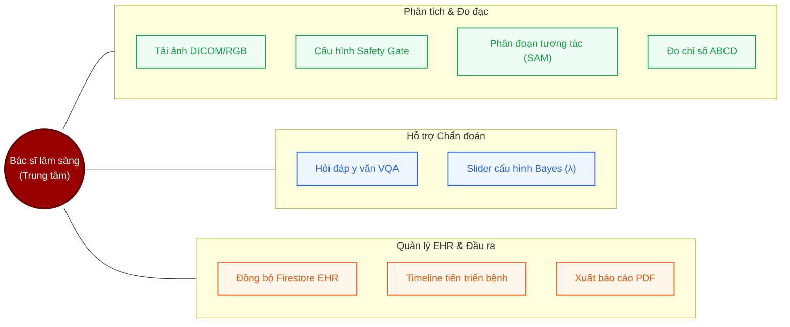
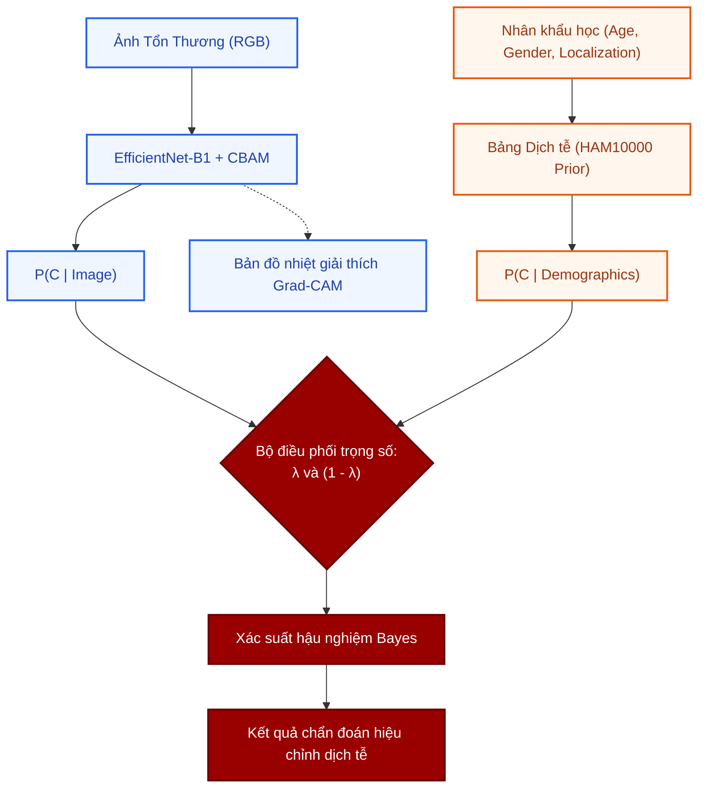
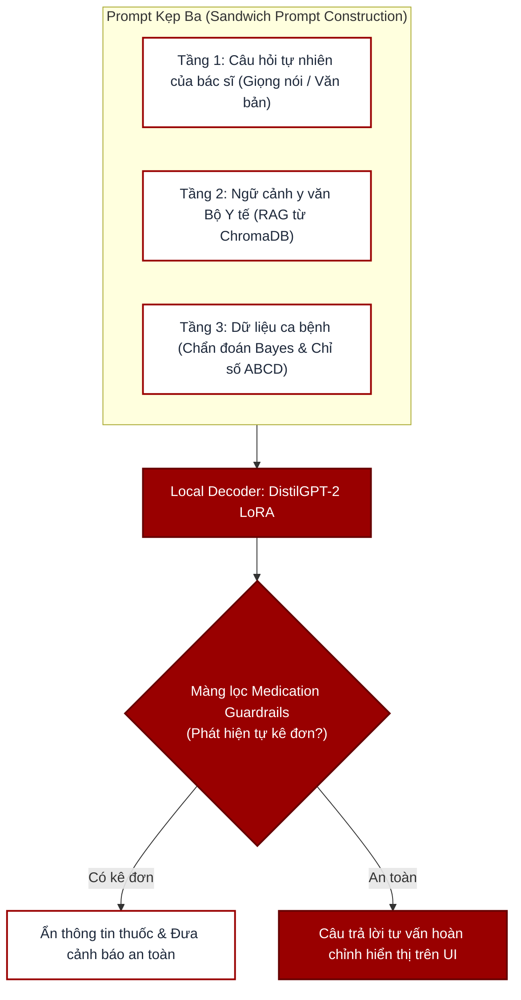
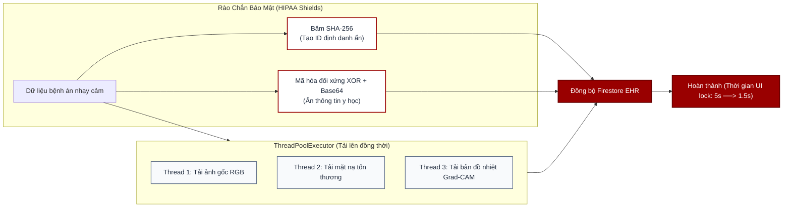

# Gợi Ý Thay Thế Kiểu Dáng Biểu Đồ Trên Slide Báo Cáo
*Tài liệu này cung cấp các giải pháp thiết kế sơ đồ thay thế để tránh việc lặp lại định dạng flowchart (hộp và mũi tên tuần tự) gây nhàm chán cho Hội đồng phản biện.*

---

## 1. Sơ đồ Kiến trúc Tổng quan (Slide 7)
* **Ý tưởng thay thế:** **Layered Stack Architecture (Kiến trúc phân lớp xếp chồng)**
* **Mô tả trực quan:** 
  * Thay vì vẽ các mũi tên chạy từ trên xuống dưới, bạn hãy thiết kế thành các lớp nằm ngang chồng lên nhau (như một tòa nhà).
  * Luồng dữ liệu đi xuyên qua các lớp từ dưới lên trên hoặc từ trái sang phải.
* **Cách bố cục trên Slide:**
  * **Lớp 1 (Đáy):** *Tầng dữ liệu đầu vào* (Ảnh RGB/DICOM) - Có thể vẽ hình chiếc camera hoặc tập tin.
  * **Lớp 2:** *Tầng lọc an toàn QA (Safety Gate)* - Vẽ như một màng lọc vật lý hoặc phễu lọc để loại ảnh mờ/ảnh phơi sáng lỗi.
  * **Lớp 3:** *Tầng lõi xử lý song song (AI Core)* - Chia thành 2 cột độc lập đứng cạnh nhau:
    * Cột trái: Phân đoạn (SAM/DeepLabV3+) -> ABCD.
    * Cột phải: Phân loại (EfficientNet-B1) -> Bayes Late Fusion.
  * **Lớp 4 (Đỉnh):** *Tầng điều phối & Đầu ra* (Tư vấn VQA, Xuất báo cáo, Lưu EHR).
* **Mã Mermaid (Dạng Phân Lớp):**
```mermaid
graph BT
    subgraph Layer4 ["TẦNG ĐẦU RA & TRỢ LÝ (Output & VQA Layer)"]
        OutputEHR["Lưu Firestore EHR"]
        PDF["Báo cáo PDF"]
        VQA["Trợ lý VQA (DistilGPT-2)"]
    end

    subgraph Layer3 ["TẦNG XỬ LÝ LÕI SONG SONG (Parallel AI Core Layer)"]
        direction LR
        subgraph Nhánh 1
            Seg["Phân đoạn SAM/DeepLabV3+"] --> ABCD["Trích xuất ABCD"]
        end
        subgraph Nhánh 2
            Cls["Phân loại EfficientNet-B1"] --> Bayes["Late Fusion Bayes"]
        end
    end

    subgraph Layer2 ["TẦNG KIỂM SOÁT CHẤT LƯỢNG (Safety Gate QA Layer)"]
        Gate["Cổng lọc chất lượng (Độ mờ Laplacian & Fitzpatrick Exposure)"]
    end

    subgraph Layer1 ["TẦNG THU NHẬN DỮ LIỆU (Input Layer)"]
        Input["Ảnh chụp từ Mobile / Tệp ảnh DICOM từ PACS"]
    end

    Input --> Gate
    Gate --> Nhánh 1
    Gate --> Nhánh 2
    ABCD --> Layer4
    Bayes --> Layer4
```

---

## 2. Sơ đồ Use Case Chức năng Hệ thống (Slide 8)
* **Ý tưởng thay thế:** **Radial Cluster / Concentric Mind Map (Sơ đồ cụm hướng tâm / Vòng tròn đồng tâm)**
* **Mô tả trực quan:** 
  * Đặt nhân vật "Bác sĩ lâm sàng" ở chính giữa slide (vẽ icon bác sĩ trong một hình tròn đỏ nổi bật).
  * Các chức năng sẽ được nhóm thành **3 phân vùng màu sắc** xung quanh bác sĩ như các cánh hoa hoặc các phân khúc bánh. Điều này giúp loại bỏ hoàn toàn các đường mũi tên chằng chịt của sơ đồ Use Case truyền thống.
* **Cách bố cục trên Slide:**
  * **Cánh phía Tây (Nhóm Tiền xử lý & Phân tích):** Cấu hình Safety Gate, Tải ảnh/DICOM, Phân đoạn tương tác, Xem chỉ số ABCD.
  * **Cánh phía Đông (Nhóm Trợ lý & Tư vấn):** Hỏi đáp VQA y văn, Kéo slider tùy chỉnh Lambda (Bayes Fusion).
  * **Cánh phía Nam (Nhóm Quản lý EHR):** Đồng bộ dữ liệu EHR, Xem timeline tiến triển bệnh, Xuất báo cáo PDF.
* **Mã Mermaid (Dạng Cụm Hướng Tâm):**


---

## 3. Sơ đồ Hợp nhất Late Fusion Bayes (Slide 11)
* **Ý tưởng thay thế:** **Y-Convergence Network (Hội tụ song song chữ Y / Cân đối cán cân gia trọng)**
* **Mô tả trực quan:** 
  * Đây là sơ đồ hoàn hảo để biểu diễn phép toán Bayes. Bạn thiết kế slide chia đôi màn hình:
    * Bên trái là nhánh **Thị giác (Vision)** màu xanh dương.
    * Bên phải là nhánh **Dịch tễ học (Demographics)** màu cam.
    * Cả hai nhánh chảy xuống dưới và hội tụ tại một **"Nút trọng số"** biểu diễn tham số $\lambda$ (nhìn như một van điều tiết hoặc một cán cân).
* **Cách bố cục trên Slide:**
  * **Trái:** Hộp ảnh gốc $\rightarrow$ Mạng EfficientNet-B1 + CBAM $\rightarrow$ Đầu ra: Xác suất ảnh $P(C_i | \text{Ảnh})$.
  * **Phải:** Hộp thông tin nhân khẩu $\rightarrow$ Bộ phân phối tiền nghiệm dịch tễ $\rightarrow$ Đầu ra: Tiền nghiệm dịch tễ $P(C_i | \text{Dịch tễ})$.
  * **Điểm hội tụ (Đáy chữ Y):** Vòng tròn biểu diễn công thức Bayes kết hợp nhân với trọng số $\lambda$ và $1-\lambda$ để cho ra kết quả chẩn đoán xác suất cuối cùng.
* **Mã Mermaid (Dạng Hội Tụ Chữ Y):**


---

## 4. Giải thuật Phân đoạn Tương tác SAM + GrabCut & Dự phòng OTSU (Slide 9)
* **Ý tưởng thay thế:** **Waterfall Fallback Path (Mô hình thác nước có nhánh rẽ dự phòng)**
* **Mô tả trực quan:**
  * Sơ đồ thiết kế theo hình chữ Z hoặc dạng bậc thang thác nước đi xuống.
  * Đường dẫn chính (Happy Path) được làm đậm nét và tô màu xanh/đỏ nổi bật (Bác sĩ click chuột $\rightarrow$ SAM $\rightarrow$ GrabCut tinh chỉnh $\rightarrow$ Chỉ số ABCD).
  * Nếu bất kỳ bước nào trong đường dẫn chính bị lỗi (kích thước quá nhỏ, ảnh không có điểm click), một mũi tên nhánh rẽ sẽ rơi xuống **Tầng dự phòng lâm sàng (Medical Fallback Layer)** bên dưới (OTSU / DeepLabV3+).
* **Mã Mermaid (Dạng Thác Nước):**
```mermaid
graph TD
    classDef main fill:#f0fdf4,stroke:#16a34a,stroke-width:2px,color:#166534;
    classDef fallback fill:#fff1f2,stroke:#f43f5e,stroke-width:2px,color:#9f1239;
    classDef endNode fill:#990000,stroke:#660000,stroke-width:2px,color:#fff;

    Start["Ảnh chụp tổn thương đầu vào"] --> CheckClick{"Bác sĩ có click chọn không?"}

    %% Đường dẫn chính (Green)
    CheckClick -->|Có click| SAM["Phân đoạn tương tác SAM"]:::main
    SAM --> GC["Tinh chỉnh biên bờ GrabCut"]:::main
    GC --> CheckSize{"Mặt nạ có hợp lệ?<br>(Kích thước > 100px)"}:::main
    
    %% Đường dẫn phụ/Dự phòng (Red/Pink)
    CheckClick -->|Không click| DL3["Phân đoạn tự động DeepLabV3+"]:::fallback
    CheckSize -->|Không hợp lệ (Lỗi)| OTSU["Phân ngưỡng Otsu thích ứng (Fallback)"]:::fallback
    DL3 --> Output["Mặt nạ tổn thương cuối cùng"]:::endNode
    
    GC -->|Hợp lệ| Output
    OTSU --> Output
    Output --> ABCD["Đo đạc chỉ số ABCD & Xuất DICOM spacing"]:::endNode
```

---

## 5. Quy trình đàm thoại VQA y văn & RAG Ngoại tuyến (Slide 12)
* **Ý tưởng thay thế:** **Sandwich Context Injection Model (Mô hình kẹp Sandwich Prompt)**
* **Mô tả trực quan:** 
  * Đây là sơ đồ mang tính minh họa cao cho RAG. Bạn vẽ một chiếc **bánh sandwich prompt** gồm 3 tầng nguyên liệu đầu vào được xếp chồng/kẹp chặt vào nhau trước khi nhét vào miệng lò LLM.
* **Cách bố cục trên Slide:**
  * **Tầng trên (Top Slice):** *Câu hỏi của bác sĩ* (Ví dụ: "Phương án điều trị dày sừng ánh sáng là gì?").
  * **Tầng giữa (Filling - Nhân bánh):** *Ngữ cảnh y văn truy xuất được* (ChromaDB tìm thấy đoạn hướng dẫn điều trị của Bộ Y tế về bệnh AKIEC).
  * **Tầng dưới (Bottom Slice):** *Thông tin bệnh án hiện tại* (Xác suất chẩn đoán Bayes, chỉ số ABCD đo đạc được).
  * Cả 3 tầng này kẹp lại thành **Prompt hợp nhất** đưa vào **LLM Decoder (DistilGPT-2 LoRA)** chạy local. Đầu ra đi qua **Màng bảo vệ thuốc (Medication Guardrails)** trước khi trả lời.
* **Mã Mermaid (Dạng Kẹp Sandwich):**


---

## 6. Sơ đồ Mã hóa Bảo mật EHR & Tải lên song song (Slide 14)
* **Ý tưởng thay thế:** **Parallel Execution Timeline (Biểu đồ thời gian & Rào chắn bảo mật)**
* **Mô tả trực quan:**
  * Thiết kế sơ đồ so sánh trực quan dạng Timeline dòng thời gian giữa **Tuần tự (Sequential)** và **Song song (Parallel)**.
  * Phía trên là rào chắn bảo mật (Tấm khiên) thể hiện việc phân tách dữ liệu y khoa thành các luồng mã hóa riêng biệt.
* **Cách bố cục trên Slide:**
  * **Bên trái (Mã hóa):** Vẽ 2 tấm khiên:
    * Khiên 1: Mã định danh $\rightarrow$ SHA-256 (không thể dịch ngược).
    * Khiên 2: Dữ liệu y học $\rightarrow$ XOR + Base64 (ẩn danh hóa).
  * **Bên phải (ThreadPool song song):** Vẽ 3 thanh ngang song song biểu diễn thời gian tải lên (Ảnh gốc, Ảnh mặt nạ, Ảnh Grad-CAM) cùng bắt đầu tại thời điểm $T=0$.
  * Phía dưới hiển thị kết quả: **UI lock time giảm từ 5s xuống còn 1.5s (giảm 70%)**.
* **Mã Mermaid (Dạng song song & khiên bảo mật):**

