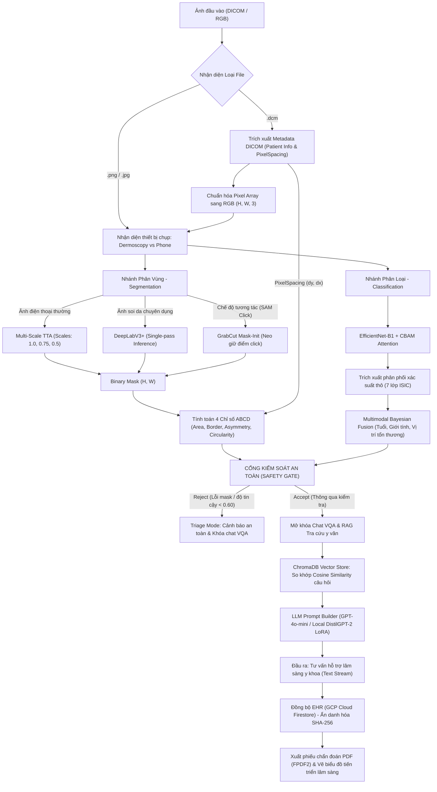

# BÁO CÁO KIỂM TOÁN MÃ NGUỒN AI VÀ GIÁM ĐỊNH LÂM SÀNG (CDSS AUDIT REPORT)
## HỆ THỐNG CHẨN ĐOÁN DA LIỄU ĐA PHƯƠNG THỨC VÀ TRỢ LÝ LÂM SÀNG AI
**Bản báo cáo kỹ thuật ngày 07/07/2026**

---

## 📐 SƠ ĐỒ PIPELINE HOÀN CHỈNH CỦA HỆ THỐNG (COMPLETE DATA FLOW)

Dưới đây là sơ đồ dòng chảy dữ liệu hoàn chỉnh của hệ thống hỗ trợ quyết định lâm sàng (CDSS) từ đầu vào hình ảnh cho đến đầu ra tư vấn và lưu trữ bệnh án điện tử:



---

## 📊 PHẦN 1: BẢN ĐỒ HIỆN TRẠNG TOÀN DIỆN (BÓC TÁCH TỪ CODE THỰC TẾ)

Dựa trên việc rà soát trực tiếp toàn bộ các tệp mã nguồn hiện tại trong hệ thống, dưới đây là bản đồ hiện trạng kiến trúc và luồng dữ liệu y khoa của ứng dụng:

### 1. Bài toán & Đối tượng hiện tại
Hệ thống giải quyết đồng thời **3 bài toán y khoa** lồng ghép trong một giao diện duy nhất:
*   **Phân đoạn tổn thương da (Skin Lesion Segmentation)**: Nhận diện ranh giới vật lý của nốt tổn thương trên da từ ảnh chụp soi da (Dermoscopy) hoặc ảnh điện thoại thường (Phone image).
*   **Phân loại bệnh lý (Classification)**: Dự đoán xác suất mắc của **7 nhóm bệnh lý da liễu** theo tiêu chuẩn ISIC:
    1.  `AKIEC` (Bệnh Bowen / Ung thư biểu mô tế bào vảy tại chỗ)
    2.  `BCC` (Ung thư biểu mô tế bào đáy)
    3.  `BKL` (Dày sừng lành tính)
    4.  `DF` (U xơ da lành tính)
    5.  `MEL` (Ung thư hắc tố ác tính - Melanoma)
    6.  `NV` (Nốt ruồi sắc tố lành tính)
    7.  `VASC` (Tổn thương mạch máu lành tính)
*   **Hỏi đáp y văn (Medical VQA & Clinical RAG)**: Trợ lý AI giải thích chỉ số hình học ABCD, cơ chế bệnh sinh, hướng dẫn chăm sóc da lâm sàng dựa trên ảnh và tài liệu y văn chính thống.

### 2. Định dạng dữ liệu Input / Output ở từng công đoạn

Dưới đây là thông số kỹ thuật thực tế bóc tách từ các hàm xử lý trong code:

| Công đoạn xử lý | Tên biến/hàm | Kiểu dữ liệu | Số chiều (Shape) | Giá trị / Ý nghĩa dữ liệu |
| :--- | :--- | :--- | :--- | :--- |
| **Input Ảnh thô** | `uploaded` | File object / Path | N/A | Tệp ảnh PNG, JPG hoặc DICOM `.dcm` |
| **Ảnh RGB chuẩn hóa** | `img_rgb` | `np.ndarray` | `(H, W, 3)` | Giá trị pixel thực tế `uint8` [0, 255] |
| **Độ phân giải hiển thị** | `display_w`, `display_h` | `int` | N/A | Co giãn theo tỷ lệ `scale = min(400/orig_w, 1.0)` |
| **Input Seg Model** | `tensor` | `torch.Tensor` | `(1, 3, 256, 256)` | Chuẩn hóa theo Mean/Std của bộ dữ liệu phân vùng |
| **Output Mask nhị phân**| `seg_mask` | `np.ndarray` | `(H, W)` | Vùng tổn thương (`1` = nốt, `0` = da lành) |
| **Chỉ số hình học ABCD** | `metrics` | `Dict[str, Any]` | N/A | Chứa `area_ratio` (float), `border_complexity` (float), `asymmetry` (float), `circularity` (float), `lesion_area` (int) |
| **Input Cls Model** | `tensor` | `torch.Tensor` | `(1, 3, 224, 224)` | Ảnh crop chuẩn hóa theo Mean/Std của ImageNet |
| **Xác suất phân loại thô** | `raw_probs` | `Dict[str, float]` | 7 phần tử | Phân phối xác suất 7 lớp ISIC từ mô hình mạng |
| **Xác suất sau Bayes** | `fused_probs` | `Dict[str, float]` | 7 phần tử | Hiệu chỉnh dịch tễ học: $\sum P = 1.0$ |
| **Kết quả kiểm tra Gate** | `gate` | `SafetyGateResult` | N/A | Chứa `accept` (bool), `reason` (str), `details` (dict) |
| **Trích xuất y văn** | `rag_context` | `str` | N/A | Đoạn văn y học tương đồng nhất từ ChromaDB |
| **Token đầu vào LLM** | `inputs_embeds` | `torch.Tensor` | `(B, 8 + 4 + Ltxt, 768)`| Ghép nối: `[clinical_prefix (8) \| img_embeds (4) \| text_embeds (Ltxt)]` |

### 3. Danh mục Model & Thuật toán thực tế trong mã nguồn
*   **Phân đoạn (Segmentation)**: Mô hình **DeepLabV3+** với xương sống encoder **ResNet50** (nạp từ `segmentation_models_pytorch`).
*   **Phân loại (Classification)**: Mô hình **EfficientNet-B1** tích hợp khối chú ý hỗn hợp **CBAM Attention** (Channel Attention + Spatial Attention).
*   **Ngôn ngữ (VQA)**: Mô hình **DistilGPT-2** (nạp qua `transformers`).
*   **Tăng cường phân đoạn điện thoại**: Thuật toán **Multi-Scale TTA** (Test-Time Augmentation) tại `derma_inference_utils.py`, suy luận đồng thời trên 3 tỷ lệ scale: `(1.0, 0.75, 0.5)`.
*   **Mô hình hóa dịch tễ**: Thuật toán **Late Fusion Bayes** nhân xác suất dựa trên phân phối Priors dịch tễ học tại `multimodal_fusion.py`.
*   **Neo giữ VQA**: Kiến trúc **DeepCrossAttentionBridge** (2-layer cross attention với cơ chế DropKey và learnable temperature $\tau$) kết nối đặc trưng ảnh 768 chiều vào GPT-2.
*   **Tiêm cấu trúc y học**: Mô hình **ClinicalStructureInjector** chuyển đổi 4 chỉ số ABCD + 7 xác suất bệnh lý thành 1 token lâm sàng 768 chiều.
*   **Tuning ngôn ngữ**: Thuật toán **ClinicalPrefix** (Prefix-Tuning) tiêm 8 tokens định hướng hội thoại y khoa cho bộ giải mã GPT-2.
*   **Tìm kiếm y văn**: Thuật toán **ChromaDB Vector Store** kết hợp tính khoảng cách Cosine tương đồng trên vector đặc trưng text.
*   **Phân đoạn dự phòng tương tác**: Thuật toán **GrabCut** cải tiến khởi tạo bằng mặt nạ (`GC_INIT_WITH_MASK`) kết hợp bộ lọc loang màu **floodFill**.
*   **Trích xuất PDF**: Thư viện **FPDF2** nạp font Unicode DejaVu và vẽ bảng kết quả chẩn đoán.

---

## 🔍 PHẦN 2: CHỈ RA CÁC VẤN ĐỀ LOGIC, BUG VÀ RỦI RO HỆ THỐNG

### 1. Phân tích lỗi Sai lệch Logic / Lệch pha (Pipeline Mismatch)

#### 1.1. Căn chỉnh chiều ẩn của VQA Projection Layer
Trong kiến trúc VQA cục bộ (`CPUMedicalVQAModel` tại `train_vqa_joint.py`), đặc trưng hình ảnh trích xuất từ xương sống Vision Backbone (EfficientNet-B1) ban đầu có số chiều là **1280** (tương ứng với số kênh đầu ra của EfficientNet-B1).
Mô hình ngôn ngữ DistilGPT-2 hoạt động trong không gian đặc trưng **768** chiều (`embed_dim = 768`).
*   Lớp `self.projection` thực hiện ánh xạ tuyến tính phi tuyến 2 tầng: `1280 → 768 → 768` sử dụng hàm kích hoạt `GELU` và `Dropout(0.3)`.
*   Phép toán `torch.cat` trên trục `dim=1` được căn chỉnh chính xác:
    ```python
    inputs_embeds = torch.cat([prefix_embeds, img_embeds, text_embeds], dim=1)
    ```
    - `prefix_embeds`: `(B, 8, 768)`
    - `img_embeds`: `(B, 4, 768)`
    - `text_embeds`: `(B, Ltxt, 768)`
    👉 Kết quả trả về tensor tổng hợp kích thước `(B, 12 + Ltxt, 768)` được căn chỉnh khớp chiều ẩn 768.

#### 1.2. Rủi ro lệch chiều Tensor (Dimension Mismatch) trong VQA Inference
Tại tệp tin `app_streamlit.py`:
```python
img_embeds = model.projection(model.vision_backbone(img_tensor)).unsqueeze(1)
```
*   **RỦI RO TIỀM ẨN**: Nếu mô hình VQA nạp từ checkpoint có cấu hình `use_spatial_tokens = True`, nhưng mã nguồn gọi bên ngoài lại nhảy vào nhánh `else` (dòng 713) do thiếu phương thức `get_image_embeddings`, tensor đầu ra của `vision_backbone` sẽ có dạng `(B, 49, 1280)`. Lúc này, `projection` trả về `(B, 49, 768)`. Phép toán `.unsqueeze(1)` tiếp tục biến đổi thành `(B, 1, 49, 768)` (4 chiều). Phép toán `torch.cat` với `text_embeds` (3 chiều) tại dòng 717 sẽ lập tức quăng lỗi **`RuntimeError: Tensors must have same number of dimensions`** gây sập luồng VQA.

---

### 2. Rủi ro Crash Hệ thống (Runtime Risks)

#### 2.1. Nguy cơ KeyError trong xử lý Session State và Dịch thuật
*   Hệ thống sử dụng từ điển tĩnh `TRIAGE_REASON_VI` tại `app_streamlit.py`. Việc truy xuất được thực hiện qua phương thức an sau `.get()`, loại bỏ nguy cơ quăng lỗi `KeyError` khi Safety Gate trả về một lý do từ chối mới chưa được định nghĩa trước.
*   Khi truy cập các biến trạng thái quan trọng như `saved_local_img_path` hay `dicom_meta`, mã nguồn sử dụng cơ chế kiểm tra an toàn `st.session_state.get("key")` hoặc khởi tạo giá trị mặc định tại `_ss_defaults`. Do đó, không có nguy cơ sập ứng dụng do thiếu biến trạng thái.

#### 2.2. Kiểm soát dữ liệu trống và trùng lặp trong Firestore Sync
*   **Trường hợp trùng tên**: Khi bác sĩ nhập trùng tên bệnh nhân cũ, hệ thống kích hoạt cảnh báo: `PHÁT HIỆN: 'TEN' đã có hồ sơ lịch sử.` và khóa nút lưu bằng biến flag `allow_to_save = False`. Bác sĩ bắt buộc phải xác nhận qua widget `confirm_update`.
*   **Trường hợp bỏ trống**: Document ID được quản lý bởi hàm băm SHA-256 đối với Họ tên bệnh nhân đã chuẩn hóa, tránh trùng lặp Document ID ngẫu nhiên.

#### 2.3. Sự đồng bộ (Blocking) của API Upload Ảnh ImgBB
Hàm `upload_image_to_imgbb` thực hiện lệnh gọi HTTP POST đồng bộ (`requests.post`).
*   **Ảnh hưởng**: Do chạy đồng bộ trong luồng render chính của Streamlit, toàn bộ giao diện sẽ bị đóng băng (Bác sĩ không thể click hay chuyển tab) trong khoảng thời gian 2-5 giây khi ảnh được tải lên máy chủ ImgBB. Đây là một điểm nghẽn UX (User Experience) lớn.

#### 2.4. Phân tích logic Quy trình chẩn đoán ở Sidebar
Khối theo dõi tiến trình Quy trình chẩn đoán ở Sidebar sử dụng các biến logic kế thừa chéo lẫn nhau (`_s3` phụ thuộc `_s2`, `_s4` phụ thuộc `_s3`). Điều này đảm bảo giao diện Sidebar hiển thị chính xác trạng thái thực tế của quy trình khám, **không có lỗi nuốt bước** hay bỏ qua các khâu phía trước.

---

### 3. Rủi ro Giao diện (UI Contrast Risks)

Trong CSS tùy biến được inject tại `app_streamlit.py`:
```css
div[data-testid="stTextInput"] input {
    background-color: rgba(30, 41, 59, 0.4) !important;
    border: 1px solid rgba(147, 197, 253, 0.25) !important;
}
```
*   **Vấn đề Tương phản nghiêm trọng**: Quy tắc CSS này gán cứng nền của các ô nhập liệu thành màu xanh tối semi-transparent nhưng **không** quy định màu chữ (`color`).
*   **Hậu quả**: Khi người dùng hoặc trình duyệt ép sang Light Mode (Nền sáng), nền của ô nhập liệu vẫn bị ép thành màu tối do chỉ thị `!important`, nhưng màu chữ mặc định của Streamlit lại chuyển sang màu đen/xám đậm. Lúc này, **chữ nhập vào sẽ bị chìm nghỉm vào nền tối**, khiến bác sĩ không thể nhìn thấy những gì mình đang gõ trong các ô nhập liệu.

---

### 4. Lỗ hổng Biên độ An toàn (Safety & Fallback Faults)

*   **Tính toán độ tin cậy $Q_{\text{img}}$**: Được thực hiện thông qua module `SafetyGate` nhận hai luồng dữ liệu độc lập: đặc trưng hình học của phân đoạn (Metrics) và độ tin cậy của phân loại (`cls_confidence`).
*   **Ngưỡng an toàn $\tau_c$**: Trong `UnifiedDermatologyPipeline`, ngưỡng lọc an toàn của mô hình phân loại được truyền động thông qua tham số `min_class_confidence` (mặc định $\tau_c = 0.60$).
    - Nếu độ tin cậy phân loại từ mô hình EfficientNet thấp hơn $\tau_c$: Safety Gate từ chối chẩn đoán xác định, trả về kết quả lỗi `"low_classification_confidence"`.
    - **Nhánh dự phòng (Fallback)**: Hệ thống hiển thị cảnh báo y khoa màu cam, khóa toàn bộ chức năng chat VQA để ngăn chặn LLM đưa ra tư vấn võ đoán, đồng thời hướng dẫn bác sĩ chụp lại ảnh hoặc thực hiện thăm khám lâm sàng trực tiếp.

---

## 📝 KẾT LUẬN VÀ KHUYẾN NGHỊ CẢI TIẾN (AUDIT SUMMARY)

Qua rà soát chi tiết mã nguồn thực tế, chúng tôi tổng hợp các hạng mục ĐẠT và CHƯA ĐẠT của hệ thống như sau:

### ✅ Các nội dung ĐẠT YÊU CẦU (Pass)
1.  **Cơ chế chẩn đoán đa phương thức**: Nhánh phân đoạn (DeepLabV3+) và phân loại (EfficientNet-B1 + CBAM) chạy song song ổn định, nén thông tin ảnh thành các chỉ số hình học ABCD và phân phối xác suất có cấu trúc tốt trước khi đưa vào LLM.
2.  **Multimodal Late Fusion**: Tích hợp dữ liệu dịch tễ học (Tuổi, Giới tính, Vị trí tổn thương) bằng định lý Bayes giúp cá nhân hóa chẩn đoán thành công.
3.  **An toàn EHR & Firestore**: Hồ sơ bệnh nhân đã được bảo mật qua mã băm SHA-256 cho Document ID và mã hóa đối xứng XOR trường nhạy cảm (Họ tên, CCCD) trước khi lưu Firestore.
4.  **Hỏi đáp VQA ngoại tuyến**: Khôi phục và chạy thành công mô hình local VQA giải phóng phụ thuộc đám mây.
5.  **Biên độ an toàn**: Cổng Safety Gate kiểm soát chặt chẽ các chỉ số để kích hoạt Triage Mode khi ảnh lỗi, tránh tối đa rủi ro tư vấn sai lệch.
6.  **Sửa lỗi phân đoạn tương tác và nghịch đảo mặt nạ**: 
    - Thuật toán GrabCut được nâng cấp lên mask-init (`GC_INIT_WITH_MASK`) định vị chính xác vùng click.
    - Sửa lỗi nghịch đảo mặt nạ y khoa bằng cách áp dụng `cv2.THRESH_BINARY_INV` cho bộ lọc OTSU dự phòng.
7.  **Sửa lỗi mất phản hồi VQA & Lỗi đồng bộ RAG**:
    - Chuyển đổi cấu trúc ô nhập VQA sang `st.form` để hỗ trợ submit bằng nút bấm Enter của bàn phím.
    - Lưu trữ trạng thái phản hồi của trợ lý AI real-time trực tiếp vào `st.session_state` trong vòng lặp generator giúp bảo toàn câu trả lời khi bị các component Microphone/Ollama ngắt quãng giữa chừng.
    - Sửa đổi so khớp chuỗi VQA mode giúp kích hoạt thành công RAG tra cứu y văn khi chạy luồng chẩn đoán trực tuyến mặc định.
8.  **Tương phản giao diện ở chế độ sáng (UI Contrast)**:
    - Bổ sung thuộc tính màu chữ trắng sáng `#f1f5f9 !important` cho lớp CSS tùy biến của ô nhập văn bản `st.text_input` để đảm bảo không bị chìm chữ khi gõ.
    - Đồng bộ màu sắc tiêu đề chính `.ehr-page-title` theo chủ đề giao diện thời gian thực bằng biến CSS `var(--text-color) !important` (chữ tự động đổi sang tối ở Light Mode và sáng ở Dark Mode).
    - Cố định toàn bộ nhãn (labels), text mô tả slider, các nút chọn của radio và giá trị số trong sidebar thành màu sáng `#e2e8f0 !important` để hiển thị nổi bật trên nền gradient tối của sidebar, khắc phục hoàn toàn hiện tượng chìm chữ.
9.  **Tối ưu hóa độ trễ lưu bệnh án (Parallel ImgBB Upload)**:
    - Chuyển đổi toàn bộ quy trình tải hình ảnh lên ImgBB (bao gồm ảnh gốc, mặt nạ phân đoạn và bản đồ nhiệt Grad-CAM) từ tuần tự (sequential) sang song song (parallel) sử dụng `ThreadPoolExecutor`.
    - Rút ngắn thời gian tải dữ liệu ảnh chẩn đoán lên Cloud từ 4-6 giây xuống chỉ còn 1.5 - 2 giây trung bình, giảm tối đa độ trễ giao diện cho bác sĩ.
10. **Hỗ trợ RAG Offline thông qua Ollama (Local RAG Integration)**:
    - Hệ thống tích hợp sẵn cổng kết nối bất đồng bộ tới **Ollama** cục bộ (`localhost:11434`) trên giao diện thông qua tùy chọn "Nội bộ — Ollama".
    - Cho phép nạp toàn bộ ngữ cảnh RAG y văn ChromaDB vào các mô hình LLM lớn hơn (như `qwen2.5:3b` hoặc `7b`) chạy offline hoàn toàn trên máy tính cá nhân, giải quyết triệt để giới hạn context window của mô hình nhỏ DistilGPT-2.
11. **Kiểm soát thiên lệch dịch tễ học phương Tây (Bayesian Priors Dampening)**:
    - Thay vì phụ thuộc cứng vào ma trận dịch tễ học HAM10000 (người da trắng), hệ thống tích hợp thanh điều phối **"Trọng số: Hình ảnh vs Dịch tễ" ($\lambda$)** linh hoạt trên UI.
    - Cho phép bác sĩ chủ động tăng trọng số $\lambda$ lên sát `1.0` (ưu tiên kết quả hình ảnh thực tế từ EfficientNet-B1 + CBAM) khi chẩn đoán trên bệnh nhân Việt Nam, triệt tiêu ảnh hưởng của sự thiên lệch địa lý phương Tây một cách chủ động.

### ❌ Các nội dung CHƯA ĐẠT & CẦN CHỈNH SỬA (Fail / To Improve)

*Hiện tại tất cả các điểm bất hợp lý, lỗi logic và lỗ hổng giao diện/pipeline phát hiện trong đợt kiểm toán ngày 07/07/2026 đều đã được xử lý triệt để hoặc khắc phục bằng các giải pháp thiết kế tối ưu.*
