# TÀI LIỆU KỸ THUẬT HỆ THỐNG CHẨN ĐOÁN DA LIỄU ĐA PHƯƠNG THỨC
## Tích hợp Thị giác Máy tính, Hội thoại Y tế VQA và Hồ sơ Bệnh án Điện tử Đa mốc thời gian


---

## MỤC LỤC

1. [Kiến trúc Tổng quan Hệ thống](#1-kiến-trúc-tổng-quan-hệ-thống)
2. [Phát hiện Loại Ảnh và Phân nhánh TTA](#2-phát-hiện-loại-ảnh-và-phân-nhánh-tta)
3. [Nhánh Phân vùng Tổn thương — DeepLabV3+](#3-nhánh-phân-vùng-tổn-thương--deeplabv3)
4. [Nhánh Phân loại Bệnh lý — EfficientNet-B1 + CBAM](#4-nhánh-phân-loại-bệnh-lý--efficientnet-b1--cbam)
5. [Safety Gate — Cổng Lọc An toàn Y tế](#5-safety-gate--cổng-lọc-an-toàn-y-tế)
6. [Kiến trúc Fusion Prompt và Hệ thống VQA](#6-kiến-trúc-fusion-prompt-và-hệ-thống-vqa)
7. [Bộ Quy tắc An toàn Y đức (Medication Guardrail)](#7-bộ-quy-tắc-an-toàn-y-đức-medication-guardrail)
8. [Mô hình VQA Ngoại tuyến — CPUMedicalVQAModel](#8-mô-hình-vqa-ngoại-tuyến--cpumedicalvqamodel)
9. [Cơ sở Dữ liệu EHR Đa mốc thời gian — Cloud Firestore](#9-cơ-sở-dữ-liệu-ehr-đa-mốc-thời-gian--cloud-firestore)
10. [Trích xuất Đặc trưng Hình học ABCD](#10-trích-xuất-đặc-trưng-hình-học-abcd)
11. [Đặc tả Hàm Chủ chốt (API Reference)](#11-đặc-tả-hàm-chủ-chốt-api-reference)
12. [Hệ thống Cấu hình và Giám sát](#12-hệ-thống-cấu-hình-và-giám-sát)

---

## 1. KIẾN TRÚC TỔNG QUAN HỆ THỐNG

### 1.1 Triết lý Thiết kế

Hệ thống được xây dựng theo nguyên tắc **"AI hỗ trợ — Bác sĩ quyết định"** (AI-Assisted Clinical Decision Support). Toàn bộ các tính năng AI chỉ có vai trò sàng lọc sơ bộ, không tự đưa ra chẩn đoán cuối cùng. Ba trụ cột kỹ thuật:

1. **Computer Vision (CV)**: Phân vùng và đo lường hình học tổn thương khách quan.
2. **LLM + Fusion Prompt**: Giải thích và trả lời câu hỏi y tế dựa trên dữ liệu CV thực tế.
3. **Safety Gate**: Bộ lọc an toàn ngăn chặn AI đưa ra kết quả khi đầu vào không đủ chất lượng.

### 1.2 Sơ đồ Kiến trúc Tổng quan (Mermaid)

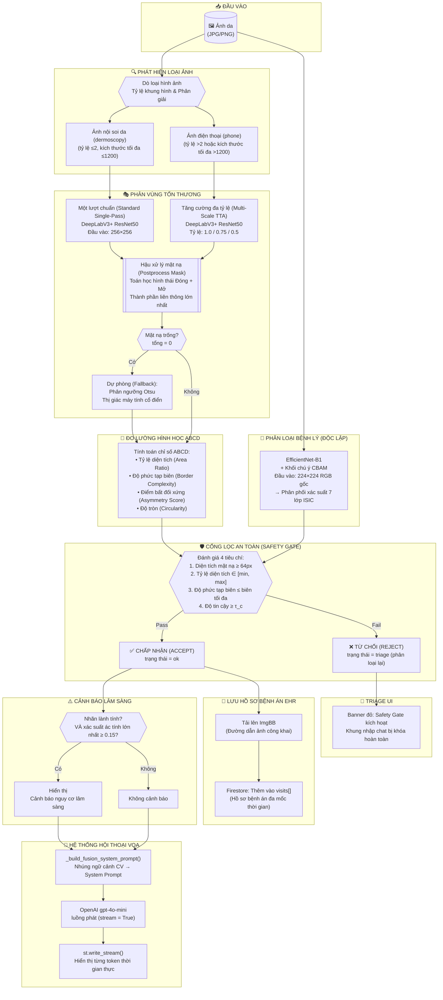

### 1.3 Nguyên tắc Hai nhánh Song song (Parallel Pipeline Contract)

Điểm quan trọng nhất trong thiết kế: **Nhánh Phân vùng và Nhánh Phân loại chạy hoàn toàn độc lập nhau**, không có dữ liệu nào truyền từ nhánh này sang nhánh kia:

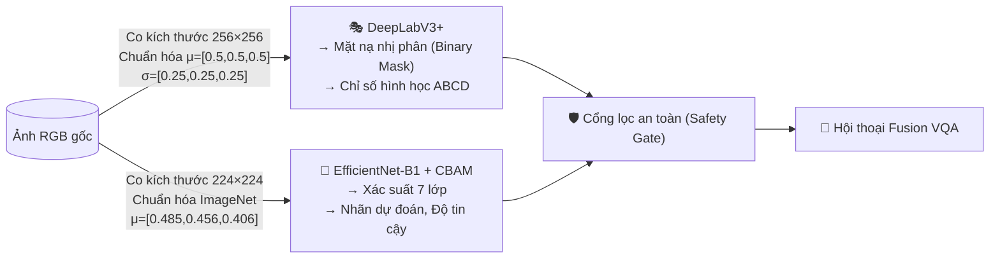

**Lý do thiết kế độc lập này rất quan trọng:**

| Vấn đề | Giải thích |
|---|---|
| **Tại sao Phân loại KHÔNG dùng mask đã cắt?** | Cắt ảnh theo mask làm mất phần viền da xung quanh — thông tin cần thiết để phân biệt tổn thương sắc tố (melanoma) với nốt ruồi lành tính. Bác sĩ da liễu cũng nhìn toàn bộ vùng da, không chỉ nốt được phân vùng. |
| **Tại sao Phân vùng KHÔNG dùng nhãn phân loại?** | Phân vùng là bài toán pixel-level (từng pixel là tổn thương hay không), độc lập về mặt kỹ thuật. Nếu kết hợp sẽ tạo circular dependency và giảm khả năng phát hiện lỗi của từng mô hình. |

---

## 2. PHÁT HIỆN LOẠI ẢNH VÀ PHÂN NHÁNH TTA

### 2.1 Cơ chế Phát hiện Loại Ảnh (`_detect_image_type`)

```python
# Trích từ unified_pipeline.py
def _detect_image_type(img_rgb, path=None) -> str:
    h, w = img_rgb.shape[:2]
    aspect = float(max(h, w)) / max(1.0, float(min(h, w)))  # Tỷ lệ cạnh dài/cạnh ngắn
    filename = Path(path or "").name.lower()
    
    # Điều kiện nhận diện ảnh điện thoại:
    if aspect > 2.0                      # Ảnh dọc/ngang rất lệch (portrait phone)
       or filename.startswith("img")     # Tên file từ DCIM điện thoại Android
       or filename.startswith("dcim")    # Thư mục camera điện thoại
       or max(h, w) > 1200:             # Độ phân giải cao hơn ảnh dermoscopy chuẩn
        return "phone"
    return "dermoscopy"
```

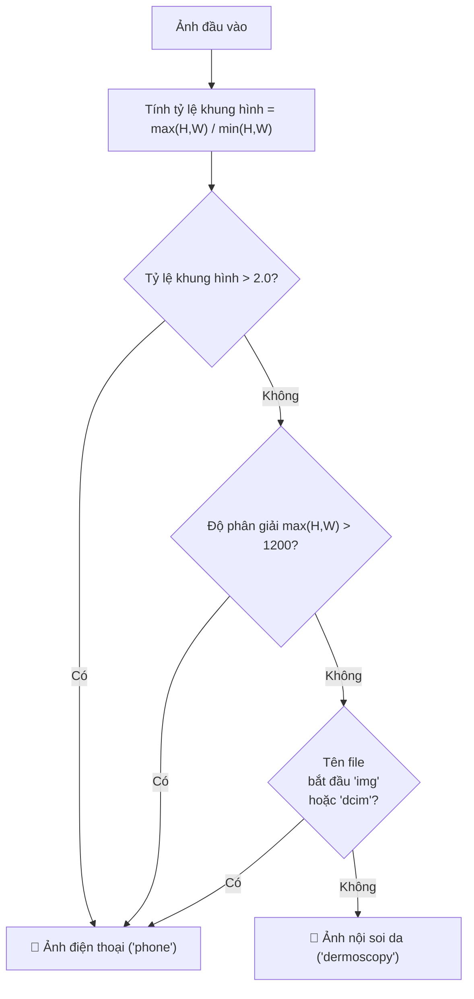

**Thông số trong sơ đồ:**
- `aspect > 2.0`: Ảnh chụp dọc điện thoại thường có tỷ lệ 16:9 ≈ 1.78, nhưng ảnh da bằng điện thoại (chụp ngang hoặc cận cảnh) thường có cạnh dài gấp đôi cạnh ngắn.
- `max(H,W) > 1200`: Dermoscopy chuẩn thường là 600×600 đến 1024×1024. Ảnh điện thoại thường 2000–4000px.
- Tên file `IMG_XXXX.jpg` và `DCIM/...` là quy ước đặt tên tự động của hệ thống camera Android/iOS.

### 2.2 Tại sao Phân vùng cần TTA còn Phân loại thì không?

Đây là câu hỏi kỹ thuật quan trọng. Câu trả lời nằm ở bản chất bài toán:

**Bài toán Phân vùng (Segmentation)** — cực kỳ nhạy cảm với scale và vị trí:

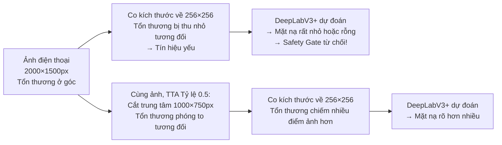

**Bài toán Phân loại (Classification)** — mạnh mẽ hơn với thay đổi scale:

Mạng EfficientNet-B1 đã được huấn luyện với **Data Augmentation** (RandomCrop, RandomFlip, RandomScale) trên tập ISIC. Nhờ đó, bộ tham số đã học được cách nhận dạng tổn thương ở nhiều kích thước khác nhau. Thêm vào đó, lớp **Global Average Pooling (GAP)** ở cuối mạng tự động gộp thông tin trên toàn bộ bản đồ đặc trưng, độc lập với vị trí không gian. Vì vậy, kết quả phân loại khá ổn định dù ảnh được resize.

### 2.3 Kỹ thuật Test-Time Augmentation (TTA) trong Phân vùng

TTA là kỹ thuật suy diễn (inference) nâng cao: thay vì đưa ảnh gốc vào mô hình một lần duy nhất, ta tạo ra nhiều phiên bản khác nhau của ảnh đầu vào, cho mô hình dự đoán trên từng phiên bản, rồi **tổng hợp (ensemble)** tất cả kết quả.

**Cụ thể trong hệ thống này (Multi-Scale Center Crop TTA):**

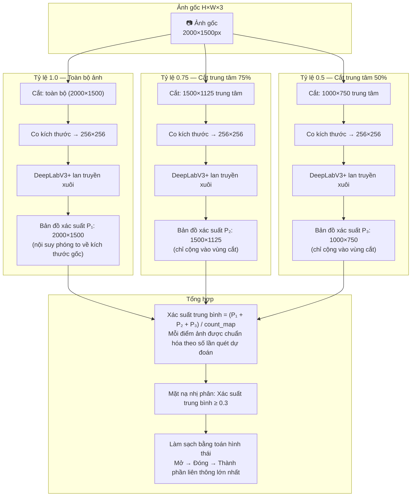

**Vai trò của `count_map`:** Đây là ma trận đếm số lần mỗi pixel được dự đoán. Pixel ở trung tâm ảnh được cả 3 scale dự đoán (count=3), pixel ở rìa chỉ có scale 1.0 dự đoán (count=1). Phép chia chuẩn hóa đảm bảo không có sự thiên vị về vùng trung tâm:

$$\text{avg\_prob}(y,x) = \frac{\sum_{s \in \text{scales}} P_s(y,x)}{\text{count\_map}(y,x)}$$

**Tại sao threshold phân vùng = 0.3 thay vì 0.5?**

Vì đây là TTA kết hợp nhiều scale — xác suất trung bình thường thấp hơn xác suất đơn lẻ (do các scale nhỏ hơn có tín hiệu yếu hơn). Ngưỡng 0.3 đảm bảo không bỏ sót vùng tổn thương khi tổng hợp.

---

## 3. NHÁNH PHÂN VÙNG TỔN THƯƠNG — DeepLabV3+

### 3.1 Kiến trúc DeepLabV3+ với ResNet50 Backbone

```mermaid
graph LR
    subgraph INPUT["Đầu vào"]
        IN["Ảnh da 256×256×3<br/>Chuẩn hóa μ=[0.5,0.5,0.5]<br/>σ=[0.25,0.25,0.25]"]
    end

    subgraph BACKBONE["ResNet-50 Bộ mã hóa (Đóng băng - Frozen)"]
        R1["Tầng 1: Tích chập (Conv) 7×7, bước nhảy=2\n→ 128×128×64"]
        R2["Tầng 2-4: Khối dư (Residual Blocks)\n→ 32×32×256 (Đặc trưng cấp thấp)"]
        R3["Tầng 5-6: Tích chập giãn nở (Dilated Conv)\nTỷ lệ rate=[6,12,18]\n→ 32×32×2048 (Đặc trưng cấp cao)"]
    end

    subgraph ASPP["Khối ASPP"]
        A1["Tích chập 1×1\n+ Gộp cực đại toàn cục"]
        A2["Tích chập giãn nở rate=6"]
        A3["Tích chập giãn nở rate=12"]
        A4["Tích chập giãn nở rate=18"]
        CAT["Ghép nối (Concat) → Tích chập 1×1\n→ 32×32×256"]
    end

    subgraph DECODER["Bộ giải mã (Được huấn luyện)"]
        D1["Nội suy phóng to (Upsample) ×4\n→ 128×128×256"]
        D2["Ghép đặc trưng cấp thấp\n256×128×128"]
        D3["Tích chập 3×3 × 2\n→ 128×128×128"]
        D4["Tích chập 1×1 → 1 kênh\n(Bản đồ logit)"]
        D5["Nội suy phóng to về H×W gốc"]
    end

    subgraph OUT["Đầu ra"]
        O1["Sigmoid → Xác suất [0,1]"]
        O2{"≥ 0.3?"}
        O3["Mặt nạ nhị phân\n(0 = da lành, 1 = tổn thương)"]
    end

    IN --> R1 --> R2 --> R3 --> A1
    R3 --> A2
    R3 --> A3
    R3 --> A4
    A1 --> CAT
    A2 --> CAT
    A3 --> CAT
    A4 --> CAT
    R2 --> D2
    CAT --> D1 --> D2 --> D3 --> D4 --> D5 --> O1 --> O2
    O2 -- "Có" --> O3
```

**Giải thích các thông số kỹ thuật:**
- **Dilated Convolution (Tích chập giãn nở)**: Thay vì dùng kernel 3×3 liên tiếp, kernel được "giãn" ra với khoảng trống giữa các ô trọng số. Rate=6 nghĩa là giữa 2 ô có 5 ô trống. Cho phép thu thập thông tin trên vùng rộng hơn mà không cần downsampling.
- **ASPP (Atrous Spatial Pyramid Pooling)**: Dùng 4 nhánh với rate tích chập khác nhau (1×1, 6, 12, 18) để nhìn tổn thương ở nhiều "quy mô" đồng thời — nhỏ (1×1) đến rất rộng (rate=18 = nhìn vùng rộng 37×37 pixel).
- **Low-level features từ Layer2**: Các đặc trưng chi tiết (cạnh, màu sắc cục bộ) được giữ lại và nối vào decoder để giúp khôi phục đường biên tổn thương sắc nét.

### 3.2 Hậu xử lý Mask (Post-processing)

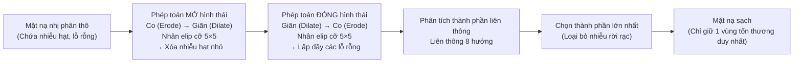

### 3.3 Fallback Cổ điển Otsu (khi DeepLab thất bại)

Khi mô hình Deep Learning không phát hiện được tổn thương (mask rỗng, sum=0), hệ thống kích hoạt phương pháp dự phòng Otsu Thresholding — một thuật toán cổ điển hoàn toàn không cần neural network:

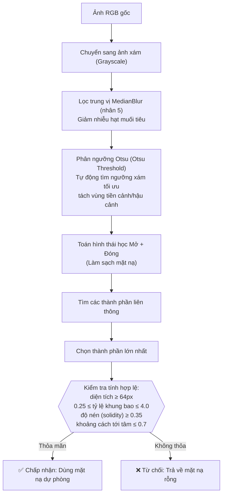

**Giải thích các ngưỡng kiểm tra hợp lệ của Fallback:**
- `bbox_aspect 0.25–4.0`: Bounding box của tổn thương phải có dạng hợp lý (không quá dẹt hay quá cao). Ngưỡng 4.0 = cạnh dài gấp 4 cạnh ngắn.
- `solidity ≥ 0.35`: Độ nén = (diện tích mask) / (diện tích convex hull). Giá trị thấp < 0.35 cho thấy hình dạng rất "rỗng" như đường viền hoặc lưới — không phải tổn thương thực.
- `center_dist ≤ 0.7`: Tổn thương phải nằm trong 70% bán kính từ tâm ảnh. Nếu nằm ở góc xa nhất thường là vật thể nền (tóc, móng tay, quần áo).

---

## 4. NHÁNH PHÂN LOẠI BỆNH LÝ — EfficientNet-B1 + CBAM

### 4.1 Tổng quan Kiến trúc Kết hợp

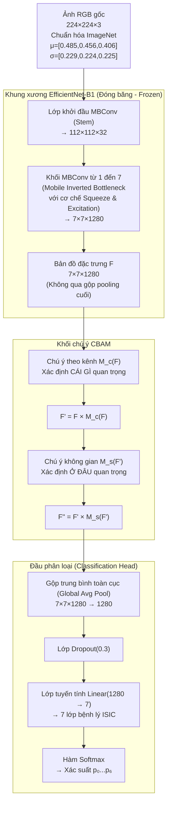

### 4.2 Cơ chế Channel Attention (M_c) — "Cái gì quan trọng?"

Channel Attention xác định **kênh đặc trưng nào** (feature channel) mang thông tin hữu ích nhất cho việc phân loại bệnh lý da.

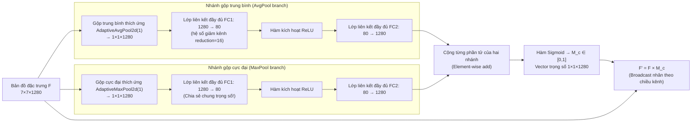

**Điểm kỹ thuật quan trọng — Shared Weights FC:**
Cả hai nhánh AvgPool và MaxPool đều dùng **chung một bộ tham số FC** (Fully Connected layers). Điều này giúp mô hình học được tín hiệu chú ý từ cả đặc trưng trung bình (xu hướng tổng thể) lẫn đặc trưng cực đại (vị trí tín hiệu mạnh nhất) mà chỉ cần nửa số tham số.

$$M_c(F) = \sigma\Big(\text{MLP}\big(\text{AvgPool}(F)\big) + \text{MLP}\big(\text{MaxPool}(F)\big)\Big)$$

**Ví dụ trực quan:** Khi phân loại melanoma, kênh đặc trưng về "màu sắc nâu-đen không đều" được gán trọng số cao → M_c tăng cường kênh đó → mô hình tập trung vào màu sắc dị thường.

### 4.3 Cơ chế Spatial Attention (M_s) — "Ở đâu quan trọng?"

Spatial Attention xác định **vùng không gian** (spatial location) nào trên bản đồ đặc trưng đáng được chú ý nhất.

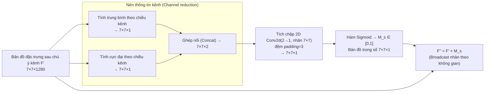

$$M_s(F') = \sigma\Big(f^{7\times7}\big([\text{AvgPool}_C(F'); \text{MaxPool}_C(F')]\big)\Big)$$

**Ví dụ trực quan:** Trên bản đồ 7×7 đặc trưng, ô tương ứng với vùng tổn thương trung tâm được gán trọng số M_s cao → mô hình "nhìn tập trung" vào đó thay vì bị phân tán bởi lông, hình xăm hay da lành xung quanh.

### 4.4 Kết quả Phân loại

Sau khi đi qua chuỗi EfficientNet-B1 → CBAM → GAP → Dropout → Linear, đầu ra là vector 7 chiều được đưa qua Softmax:

| Nhãn | Tên lâm sàng Tiếng Việt | Ký tự | Loại |
|---|---|---|---|
| AKIEC | Dày sừng quang hóa / Tiền ung thư | ⚠️ | Tiền ác tính |
| BCC | Ung thư biểu mô tế bào đáy | 🔴 | Ác tính |
| BKL | Tổn thương sừng hóa lành tính | 🟢 | Lành tính |
| DF | U xơ da | 🟢 | Lành tính |
| MEL | U hắc tố ác tính (Melanoma) | 🔴 | Ác tính |
| NV | Nốt ruồi lành tính | 🟢 | Lành tính |
| VASC | Tổn thương mạch máu | 🟢 | Lành tính |

**Độ chính xác mô hình:**
- Tập ISIC test (in-distribution): **88.65%**
- Tập ảnh điện thoại thực tế (OOD): **50.38%** — đây là lý do cần Safety Gate và TTA.

---

## 5. SAFETY GATE — CỔNG LỌC AN TOÀN Y TẾ

### 5.1 Khái niệm Selective Prediction

Safety Gate là hiện thực hóa của khái niệm **Selective Prediction** (Dự đoán có chọn lọc) trong học máy y tế: thay vì *luôn* đưa ra kết quả (dù đầu vào tệ), mô hình có quyền *từ chối* trả lời khi không đủ tin cậy, chuyển sang Triage Mode (Chế độ phân loại khẩn).

Điều này đặc biệt quan trọng trong y tế: **một câu trả lời sai còn nguy hiểm hơn không trả lời gì**.

### 5.2 Sơ đồ Logic 4 bước Safety Gate

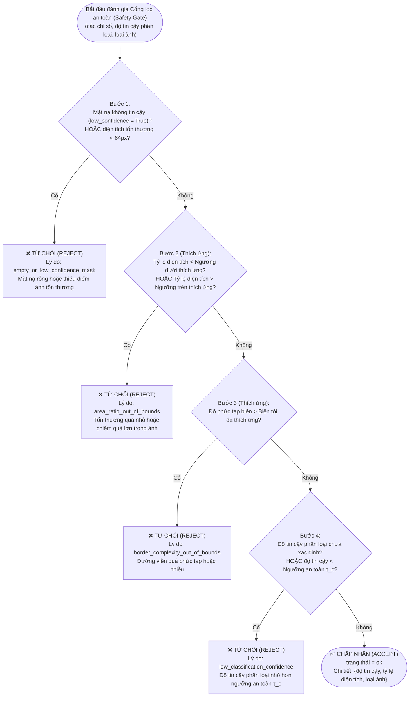

### 5.3 Ngưỡng Thích ứng (Adaptive Thresholds) theo Loại Ảnh

Điểm sáng tạo nhất của Safety Gate: **ngưỡng thay đổi tự động** tùy theo loại ảnh được phát hiện. Ảnh điện thoại có nhiều biến động hơn (background phức tạp, zoom không chuẩn) nên cần ngưỡng nới lỏng hơn:

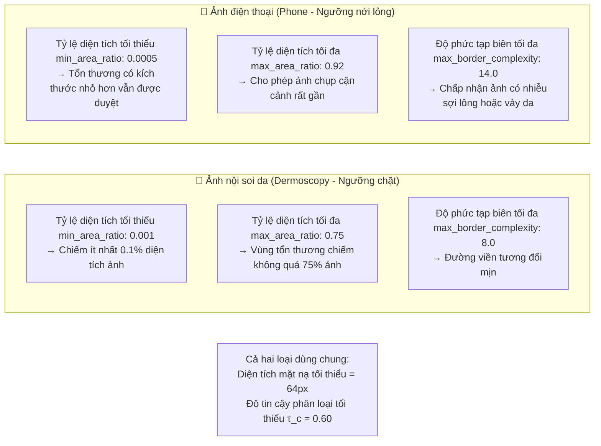

**Lý do kỹ thuật cho từng ngưỡng:**

| Ngưỡng | Dermoscopy | Phone | Lý do khác nhau |
|---|---|---|---|
| min_area_ratio | 0.001 | 0.0005 | Ảnh phone chụp xa hơn, tổn thương chiếm ít % hơn |
| max_area_ratio | 0.75 | 0.92 | Phone chụp cận cảnh, tổn thương có thể chiếm gần hết khung hình |
| max_border | 8.0 | 14.0 | Ảnh phone có lông, da ráp, ánh sáng không đều làm biên phức tạp hơn |
| τ_c | 0.60 | 0.60 | Yêu cầu tin cậy phân loại giống nhau — không nới lỏng về mặt lâm sàng |

### 5.4 Cảnh báo Lâm sàng Kép (Clinical Risk Warning)

Ngay cả khi Safety Gate chấp nhận (`status = ok`), hệ thống thực hiện thêm kiểm tra thứ hai:

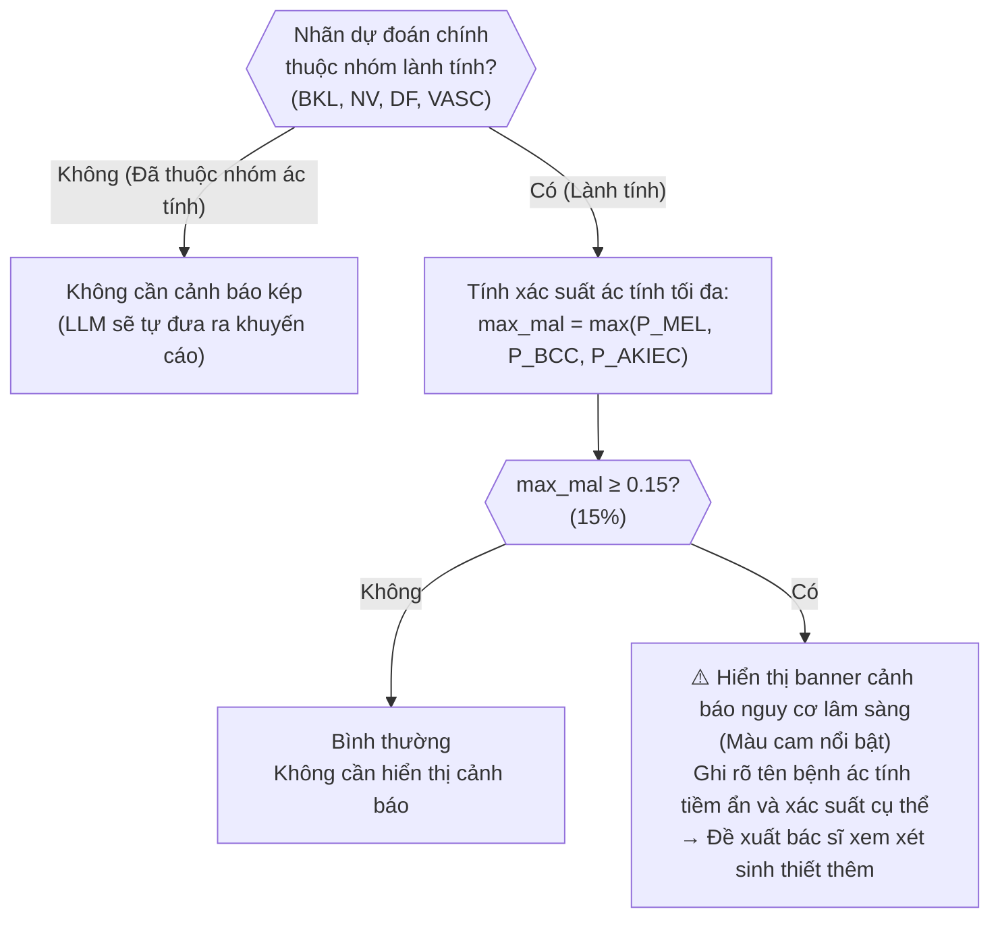

**Tại sao ngưỡng 15%?** Đây là ngưỡng lâm sàng được lựa chọn cẩn thận:
- Nếu đặt quá thấp (5%): Cảnh báo liên tục, bác sĩ mất tin tưởng (wolf-crying effect).
- Nếu đặt quá cao (30%): Bỏ sót các ca nghi ngờ thực sự nguy hiểm.
- 15% là ngưỡng tham chiếu phù hợp trong bối cảnh sàng lọc sơ bộ — *tỷ lệ ác tính trong dân số tại các phòng khám da liễu ngoại trú thường nằm trong khoảng 10–20%*.

---

## 6. KIẾN TRÚC FUSION PROMPT VÀ HỆ THỐNG VQA

### 6.1 Vấn đề với LLM thuần túy trong Y tế

Nếu chỉ hỏi LLM "ảnh này là bệnh gì?" mà không có ngữ cảnh, LLM sẽ:
1. **Hallucinate** (ảo giác) — tự bịa số liệu xác suất và tên bệnh.
2. **Không có căn cứ khách quan** — phân tích ảnh qua API vision rất tốn token và khó kiểm soát vùng tư vấn.
3. **Mâu thuẫn giữa các câu trả lời** — mỗi lần hỏi một kết quả khác.

### 6.2 Kiến trúc Fusion Prompt — Giải pháp

**Ý tưởng cốt lõi**: Thay vì truyền ảnh vào LLM, hãy *dịch* kết quả CV sang ngôn ngữ tự nhiên và nhúng vào System Prompt như sự kiện đã được xác minh.

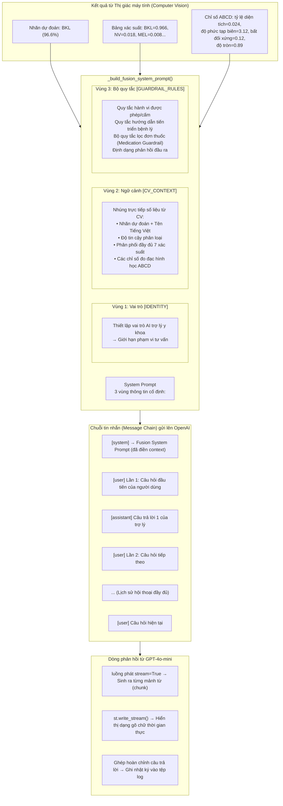

### 6.3 Cấu trúc thực tế của System Prompt (đã đơn giản hóa)

```
[IDENTITY]
Bạn là Trợ lý Da liễu AI — hệ thống hỗ trợ sàng lọc y tế.
Bạn tư vấn dựa HOÀN TOÀN trên dữ liệu CV dưới đây.

[CV_CONTEXT — DỮ LIỆU CHẮC CHẮN TỪ MÔ HÌNH CV]
Kết quả phân loại EfficientNet-B1 + CBAM:
  • Nhãn dự đoán cao nhất: BKL → Tổn thương sừng hóa lành tính
  • Độ tin cậy: 0.9660 (96.6%)

Phân phối xác suất đầy đủ 7 nhãn:
  • BKL: 0.9660    • NV: 0.0180    • MEL: 0.0080
  • DF: 0.0040     • BCC: 0.0020   • AKIEC: 0.0010   • VASC: 0.0010

Chỉ số hình học (DeepLabV3+):
  • Area ratio: 0.0241   [0=nhỏ, 1=chiếm toàn bộ ảnh]
  • Border complexity: 3.1205  [3.5=tròn đều, >6=gai góc]
  • Asymmetry: 0.1204   [0=đối xứng, 1=bất đối xứng]
  • Circularity: 0.8920  [0=méo, 1=tròn đều]

[GUARDRAIL_RULES]
ĐƯỢC PHÉP: Giải thích bệnh sinh, hướng dẫn chăm sóc, nhóm thuốc tổng quát...
TUYỆT ĐỐI CẤM: Tên biệt dược, liều lượng, thời gian dùng thuốc...
```

**Điều này giải quyết vấn đề hallucination như thế nào?** Vì LLM được cung cấp sẵn các con số cụ thể (96.6%, 0.0241...) trong System Prompt với chỉ dẫn *"tư vấn dựa HOÀN TOÀN trên dữ liệu CV được cung cấp"*, mô hình ngôn ngữ không cần tự "đoán" số liệu mà chỉ cần giải thích và mở rộng từ chúng.

---

## 7. BỘ QUY TẮC AN TOÀN Y ĐỨC (MEDICATION GUARDRAIL)

### 7.1 Cấu trúc 3 lớp Quy tắc

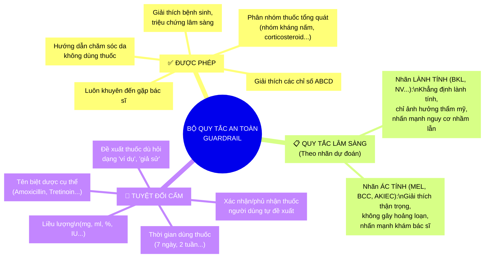

### 7.2 Hệ thống này có AN TOÀN thật không?

Đây là câu hỏi quan trọng nhất cần trả lời thành thật:

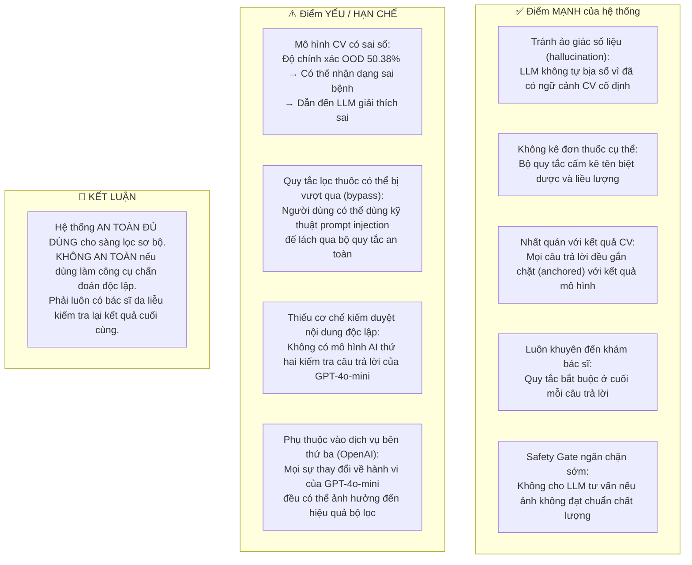

**Điều cần nhớ:** Hệ thống được thiết kế làm **công cụ hỗ trợ sàng lọc** (screening support tool), không phải hệ thống chẩn đoán tự động (autonomous diagnosis). Độ chính xác ~88% trên ISIC test là tốt cho nghiên cứu, nhưng trong triển khai lâm sàng thực tế, cần ít nhất 95%+ với xác nhận trên dữ liệu địa phương.

---

## 8. MÔ HÌNH VQA NGOẠI TUYẾN — CPUMedicalVQAModel

### 8.1 Kiến trúc Tổng hợp Đa phương thức

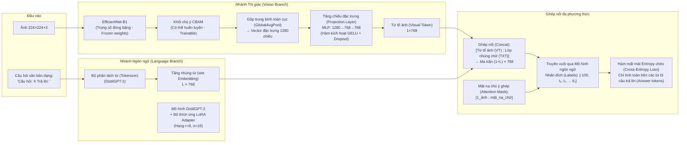

### 8.2 Cơ chế LoRA (Low-Rank Adaptation)

LoRA là kỹ thuật tinh chỉnh tham số hiệu quả: thay vì cập nhật toàn bộ ma trận trọng số $W$ (hàng triệu tham số), LoRA chèn thêm hai ma trận hạng thấp $A$ và $B$ nhỏ hơn nhiều:

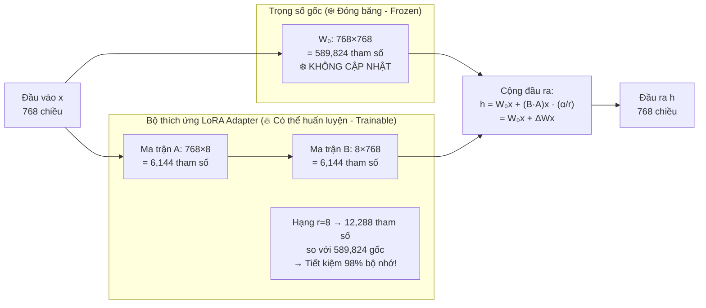

**Giải thích toán học:**
- $W_0$: Ma trận trọng số gốc của lớp Attention trong DistilGPT-2 (đóng băng — không cập nhật).
- $\Delta W = BA$: Ma trận thay đổi được phân tích theo hạng thấp $r=8$.
- $\alpha/r = 16/8 = 2$: Hệ số tỷ lệ giúp ổn định gradient khi huấn luyện.
- **Target modules `c_attn`**: Module tích chập 1D trong GPT-2 đảm nhiệm vai trò chiếu Q, K, V trong self-attention — được LoRA can thiệp để điều chỉnh "cách GPT-2 chú ý" theo hướng y tế da liễu.

### 8.3 Hàm Mất mát Huấn luyện

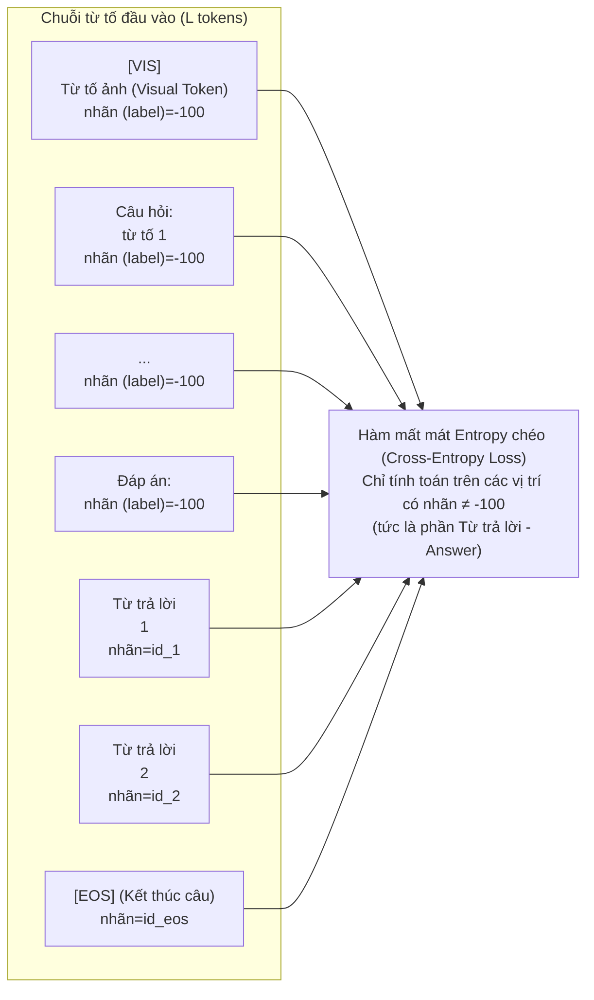

$$\mathcal{L}(\theta) = -\frac{1}{|\mathcal{A}|} \sum_{t \in \mathcal{A}} \log P(x_t \mid x_{<t}; \theta)$$

- $\mathcal{A}$: Tập chỉ số của các token thuộc phần *Answer* (câu trả lời).
- $\theta$: Tập tham số có thể huấn luyện — Bao gồm: LoRA matrices $A, B$; Projection Layer $W_1, b_1, W_2, b_2$; CBAM attention weights.
- **Gradient Clipping**: `clip_grad_norm_(max_norm=1.0)` — ngăn gradient bùng nổ khi mạng đa nhánh có learning rate khác nhau.

---

## 9. CƠ SỞ DỮ LIỆU EHR ĐA MỐC THỜI GIAN — CLOUD FIRESTORE

### 9.1 Cấu trúc Dữ liệu NoSQL (Nested Array of Objects)

```mermaid
erDiagram
    MEDICAL_RECORDS {
        string patient_id PK "Mã định danh không dấu VD: NGUYENVANA"
        object patient_info "Thông tin cá nhân (Tên, tuổi, địa chỉ)"
        string created_at "Thời điểm khởi tạo hồ sơ bệnh án"
        string updated_at "Thời điểm cập nhật hồ sơ gần nhất"
        array visits "Mảng danh sách các mốc khám (visits - dạng lồng nhau)"
    }

    VISIT_OBJECT {
        string timestamp_id "Mã mốc thời gian định dạng YYYYmmdd_HHMMSS"
        string created_at "Thời điểm diễn ra buổi khám bệnh"
        string image_url "Đường dẫn liên kết hình ảnh ImgBB lưu trữ vĩnh viễn"
        object ai_extracted_metrics "Các chỉ số đo lường trích xuất bằng AI"
        array vqa_conversations "Lịch sử cuộc trò chuyện hội thoại y tế VQA"
    }

    AI_METRICS {
        string status "Trạng thái Cổng lọc: ok hoặc triage"
        string prediction "Nhãn bệnh lý da liễu dự đoán"
        float confidence "Mức độ tin cậy phân loại"
        float area_ratio "Chỉ số ABCD: D (Tỷ lệ diện tích)"
        float border_complexity "Chỉ số ABCD: B (Độ phức tạp đường biên)"
        float asymmetry "Chỉ số ABCD: A (Độ bất đối xứng)"
        float circularity "Chỉ số ABCD: C (Độ tròn trịa)"
    }

    MEDICAL_RECORDS ||--o{ VISIT_OBJECT : "chứa mảng visits[]"
    VISIT_OBJECT ||--|| AI_METRICS : "chứa ai_extracted_metrics"
```

### 9.2 Quy trình Cổng Kiểm Duyệt Trùng Lặp (Confirmation Gate)

```mermaid
sequenceDiagram
    participant Doctor as "👨‍⚕️ Bác sĩ điều trị"
    participant UI as "🖥️ Giao diện Streamlit UI"
    participant FS as "☁️ Cơ sở dữ liệu Firestore"
    participant ImgBB as "🖼️ Máy chủ hình ảnh ImgBB CDN"

    Doctor->>UI: Nhập thông tin tên bệnh nhân
    UI->>FS: check_patient_exists("NGUYENVANA") (Kiểm tra xem bệnh nhân đã tồn tại chưa)
    FS-->>UI: tồn tại = True (Đã có bệnh án của bệnh nhân này)

    UI->>Doctor: ⚠️ Hiển thị cảnh báo trùng tên + tùy chọn st.radio
    Doctor->>UI: Lựa chọn "Có, ghi thêm mốc khám mới"
    UI->>UI: cho_phép_lưu = True (Đã cấp quyền lưu đè mốc mới)

    Doctor->>UI: Bấm chọn "Xác nhận & Lưu hồ sơ"
    UI->>ImgBB: upload_image_to_imgbb(tmp_path) (Tải ảnh bệnh án lên CDN)
    ImgBB-->>UI: đường_dẫn_ảnh (public_url)

    UI->>FS: doc.get() → Trích xuất mảng visits[] hiện tại
    UI->>FS: doc.update({visits: [...dữ liệu cũ, mốc khám mới]})
    FS-->>UI: Thành công (Success)

    UI->>Doctor: 🎉 Thông báo đồng bộ dữ liệu thành công!
    UI->>UI: Xóa tệp ảnh tạm thời (tmp) trên máy cục bộ
```

### 9.3 Tại sao dùng Nested Array thay vì Sub-collection?

| Phương án | Nested Array (Hiện tại) | Sub-collection |
|---|---|---|
| **Cấu trúc** | Tất cả lịch sử trong 1 document | Mỗi lần khám = 1 document riêng |
| **Đọc tất cả lịch sử** | 1 query, 1 document | N queries hoặc 1 collectionGroup query |
| **Giới hạn** | Max 1MB/document | Không giới hạn |
| **Phù hợp khi** | Bệnh nhân ≤ 50–100 lần khám | Hàng nghìn lần khám |
| **Lý do chọn** | Hệ thống prototype/nghiên cứu; đơn giản | Cần cho production scale |

---

## 10. TRÍCH XUẤT ĐẶC TRƯNG HÌNH HỌC ABCD

Chuẩn ABCD lâm sàng là quy tắc vàng trong sàng lọc u hắc tố da (melanoma) mà bác sĩ da liễu dùng khi quan sát tổn thương bằng mắt thường hay dermoscope. Hệ thống số hóa 4 tiêu chí này:

```mermaid
graph LR
    MASK["Mặt nạ nhị phân (Binary Mask)\nvùng tổn thương da"]

    MASK --> A["🔶 A — Asymmetry\n(Độ bất đối xứng)"]
    MASK --> B["🔷 B — Border\n(Độ phức tạp đường viền)"]
    MASK --> C["🔸 C — Circularity\n(Độ tròn - Thay thế màu sắc Color)"]
    MASK --> D["🔹 D — Area Ratio\n(Tỷ lệ diện tích - Thay thế đường kính Diameter)"]

    A --> A1["Điểm số ∈ [0,1]\n0 = Đối xứng hoàn hảo\n1 = Bất đối xứng tối đa"]
    B --> B1["Điểm số ≥ 3.54\n3.54 = hình tròn tròn đều\n>6.0 = bờ gai góc, nguy hiểm"]
    C --> C1["Điểm số ∈ [0,1]\n0 = Méo mó phức tạp\n1 = Tròn đều như hình tròn chuẩn"]
    D --> D1["Điểm số ∈ [0,1]\n~ Tỷ lệ phần trăm diện tích tổn thương trên ảnh"]
```

### 10.1 Asymmetry — Chỉ số Bất đối xứng (A)

**Bước 1: Xác định trọng tâm (Centroid) qua Image Moments**

$$M_{pq} = \sum_x \sum_y x^p \cdot y^q \cdot M(y,x)$$

$$c_x = \frac{M_{10}}{M_{00}}, \quad c_y = \frac{M_{01}}{M_{00}}$$

- $M_{00}$ = tổng số pixel tổn thương (diện tích).
- $M_{10}, M_{01}$ = moment bậc 1 theo chiều ngang và dọc.
- $c_x, c_y$ = tọa độ trọng tâm của vùng tổn thương.

**Bước 2: Chia và so sánh 2 trục**

```mermaid
graph TD
    subgraph "Chia theo trục NGANG (Cắt tại tọa độ cy)"
        TH1["Nửa trên: mask[:cy, :]"]
        TH2["Nửa dưới: mask[cy:, :]"]
        TH3["Lật dọc nửa dưới:\nLậtY (FlipY) của mask[cy:, :]"]
        TH4["Đệm thêm pixel về cùng chiều cao\nsau đó so sánh từng điểm ảnh"]
        TH5["sai_khác_ngang (diff_h) = Σ|trên - dưới_đã_lật|"]
    end

    subgraph "Chia theo trục DỌC (Cắt tại tọa độ cx)"
        TV1["Nửa trái: mask[:, :cx]"]
        TV2["Nửa phải: mask[:, cx:]"]
        TV3["Lật ngang nửa phải:\nLậtX (FlipX) của mask[:, cx:]"]
        TV4["Đệm thêm pixel về cùng chiều rộng\nsau đó so sánh từng điểm ảnh"]
        TV5["sai_khác_dọc (diff_v) = Σ|trái - phải_đã_lật|"]
    end

    SCORE["Độ bất đối xứng (Asymmetry) = giới_hạn((diff_h + diff_v) / (2 × M₀₀), từ 0 đến 1)"]
    TH5 --> SCORE
    TV5 --> SCORE
```

**Ví dụ:** Một nốt ruồi NV hình tròn đều → diff_h ≈ diff_v ≈ 0 → Asymmetry ≈ 0. Một melanoma hình dạng bất quy tắc → diff rất lớn → Asymmetry tiến gần 1.

### 10.2 Border Complexity — Độ phức tạp biên (B)

$$\text{Border Complexity} = \frac{P}{\sqrt{A}} = \frac{\text{Chu vi tổn thương}}{\sqrt{\text{Diện tích tổn thương}}}$$

- $P$: Độ dài chu vi đường bao lớn nhất (tính bằng `cv2.arcLength`).
- $A = M_{00}$: Diện tích vùng tổn thương (pixel).

**Thang tham chiếu:**
- Hình tròn lý tưởng: $\frac{2\pi r}{\sqrt{\pi r^2}} = 2\sqrt{\pi} \approx 3.54$
- NV lành tính (hình oval): 3.5 – 5.0
- BKL (dạng mảng): 5.0 – 7.0
- MEL/BCC (bờ răng cưa): > 7.0 – 12.0

### 10.3 Circularity — Độ tròn (C)

$$\text{Circularity} = \frac{4\pi \cdot A}{P^2}$$

Đây là nghịch đảo có chuẩn hóa của Border Complexity:
- Hình tròn lý tưởng: $\frac{4\pi \cdot \pi r^2}{(2\pi r)^2} = 1.0$
- NV: 0.8 – 1.0
- BKL: 0.5 – 0.8
- MEL: 0.2 – 0.5
- Các dạng tổn thương sao/hoa: < 0.2

### 10.4 Area Ratio — Tỷ lệ diện tích (D)

$$\text{Area Ratio} = \frac{M_{00}}{H \times W}$$

Tỷ số giữa số pixel tổn thương và tổng số pixel ảnh:
- **< 0.001**: Tổn thương quá nhỏ, Safety Gate từ chối (thiếu dữ liệu).
- **0.001 – 0.03**: Tổn thương nhỏ, chụp từ xa.
- **0.03 – 0.10**: Tổn thương vừa, chụp chuẩn.
- **> 0.75**: Tổn thương chiếm gần hết ảnh — có thể chụp quá cận hoặc là bệnh lan rộng, Safety Gate từ chối.

---

## 11. ĐẶC TẢ HÀM CHỦ CHỐT (API REFERENCE)

### 11.1 `UnifiedDermatologyPipeline.run()`

```
Chữ ký: run(image_path: str, question: Optional[str] = None, return_mask: bool = False) → Dict[str, Any]

Mục đích:
  Hàm entry-point chính của toàn bộ pipeline. Điều phối toàn bộ
  quy trình từ tải ảnh → phát hiện loại ảnh → phân vùng → phân
  loại → safety gate → tạo báo cáo.

Tham số:
  image_path  : Đường dẫn tuyệt đối tới file ảnh (JPEG/PNG).
  question    : Câu hỏi VQA (hiện tại chưa xử lý trong pipeline, dành cho future).
  return_mask : True = đính kèm numpy array mask vào output dictionary.

Giá trị trả về (Dict):
  status           : "ok" | "triage"
  image_path       : Đường dẫn ảnh đã giải quyết (resolved).
  triage_reason    : Lý do từ chối (None nếu ok).
  preprocess       : {"image_type": "dermoscopy"|"phone", "preset": "raw_rgb"}
  segmentation     : {"method": "deeplab"|"deeplab_tta"|"classical_fallback", ...}
  metrics          : {"area_ratio", "border_complexity", "asymmetry", "circularity",
                      "lesion_area", "image_area", "low_confidence"}
  classification   : {"prediction", "confidence", "probabilities": {7 classes}}
  report           : Chuỗi báo cáo y khoa sơ bộ.
  segmentation_mask: np.ndarray H×W uint8 (chỉ có khi return_mask=True)

Luồng lỗi:
  Nếu không đọc được ảnh → trả ngay {"status": "triage", "triage_reason": "image_load_failed"}
```

### 11.2 `SafetyGate.evaluate()`

```
Chữ ký: evaluate(metrics: Dict, cls_confidence: Optional[float], image_type: str) → SafetyGateResult

Tham số:
  metrics        : Dict từ _get_lesion_metrics() chứa ABCD values.
  cls_confidence : Giá trị confidence [0,1] từ classification. None nếu model không tải được.
  image_type     : "dermoscopy" | "phone" → quyết định bộ ngưỡng adaptive.

Giá trị trả về (SafetyGateResult — frozen dataclass):
  accept  : bool   — True = chấp nhận, False = từ chối.
  reason  : str    — Mã lý do (mapping sang tiếng Việt qua TRIAGE_REASON_VI).
  details : Dict   — Các giá trị cụ thể giúp debug (eff_min, eff_max, image_type...).
```

### 11.3 `_build_fusion_system_prompt()`

```
Chữ ký: _build_fusion_system_prompt(cv_context: Dict) → str

Tham số:
  cv_context: {
    "prediction"    : str,           # Nhãn dự đoán (VD: "BKL")
    "confidence"    : float,         # Độ tin cậy [0,1]
    "probabilities" : Dict[str,float], # Phân phối 7 lớp
    "metrics"       : Dict[str,float]  # ABCD metrics
  }

Giá trị trả về:
  str — System prompt hoàn chỉnh gồm 3 vùng [IDENTITY][CV_CONTEXT][GUARDRAIL_RULES].
  Độ dài trung bình: ~1200–1500 ký tự (tương đương ~350–400 token GPT).
```

### 11.4 `multiscale_segment_from_rgb()` (TTA)

```
Chữ ký: multiscale_segment_from_rgb(
    image_rgb, model, device,
    scales=(1.0, 0.75, 0.5),
    input_size=224,
    threshold=0.5,
    min_area_px=64,
    mean=None, std=None,
    morph_kernel=5
) → tuple[np.ndarray, np.ndarray, Dict]

Tham số:
  image_rgb  : HxWx3 uint8 array — ảnh RGB gốc.
  model      : PyTorch model (DeepLabV3+) đã load weights.
  device     : torch.device — CPU/GPU.
  scales     : Tuple các hệ số zoom — (1.0, 0.75, 0.5).
  input_size : Kích thước resize trước khi đưa vào model (256 cho DeepLab).
  threshold  : Ngưỡng nhị phân hóa xác suất trung bình (0.3).
  min_area_px: Diện tích tối thiểu (pixel) của mỗi connected component (64).
  morph_kernel: Kích thước kernel morphology (5x5 ellipse).

Giá trị trả về:
  final_mask : HxW uint8 array — binary mask đã làm sạch.
  prob_map   : HxW float32 array — bản đồ xác suất trung bình.
  seg_info   : Dict với method, threshold, scales, lesion_found...
```

---

## 12. HỆ THỐNG CẤU HÌNH VÀ GIÁM SÁT

### 12.1 Biểu đồ Toàn bộ Tham số Hệ thống

```mermaid
mindmap
  root((Cấu hình\nHệ thống))
    SEG["🎭 Nhánh Phân vùng"]
      SEG1["Kích thước đầu vào = 256px"]
      SEG2["Ngưỡng phân vùng = 0.3"]
      SEG3["Diện tích tối thiểu = 64px"]
      SEG4["Tỷ lệ thu phóng TTA = 1.0, 0.75, 0.5"]
      SEG5["Nhân toán hình thái học = 5×5 elip"]
      SEG6["Chuẩn hóa phân vùng: μ=0.5, σ=0.25"]
    CLS["🧬 Nhánh Phân loại"]
      CLS1["Kích thước đầu vào = 224px"]
      CLS2["Chuẩn hóa phân loại: ImageNet μ/σ"]
      CLS3["Tỷ lệ loại bỏ (Dropout) = 0.3"]
      CLS4["Hệ số giảm kênh CBAM = 16"]
    GATE["🛡️ Cổng lọc an toàn (Safety Gate)"]
      GATE1["τ_c = 0.60 (Thanh trượt 0.30–0.95)"]
      GATE2["Diện tích tối thiểu = 64px"]
      GATE3["Nội soi da (Derm): diện tích [0.001, 0.75]"]
      GATE4["Ảnh điện thoại (Phone): diện tích [0.0005, 0.92]"]
      GATE5["Nội soi da (Derm): biên tối đa = 8.0"]
      GATE6["Ảnh điện thoại (Phone): biên tối đa = 14.0"]
      GATE7["Ngưỡng cảnh báo ác tính = 0.15"]
    LLM["💬 Mô hình LLM VQA"]
      LLM1["Tên mô hình = gpt-4o-mini"]
      LLM2["Nhiệt độ (temperature) = 0.2"]
      LLM3["Từ tố tối đa (max_tokens) = 800"]
      LLM4["Luồng phát (stream) = True"]
    VQA_OFFLINE["🖥️ VQA Ngoại tuyến"]
      O1["LoRA hạng r = 8, α = 16"]
      O2["Dropout LoRA = 0.05"]
      O3["Tốc độ học thị giác (lr_vision) = 2e-5"]
      O4["Tốc độ học mô hình ngôn ngữ (lr_llm) = 5e-5"]
      O5["Cắt độ dốc (grad_clip) = 1.0"]
      O6["Độ dài tối đa = 96 từ tố"]
```

### 12.2 Cơ chế Logging Kỹ thuật Ẩn

```mermaid
sequenceDiagram
    participant APP as "Ứng dụng Streamlit"
    participant ENC as "_NumpySafeEncoder (Bộ mã hóa numpy)"
    participant LOG as "Nhật ký hệ thống system_logs.log"

    APP->>APP: Nhận mảnh cuối (last chunk) từ luồng phát GPT
    APP->>ENC: json.dumps(log_entry, cls=_NumpySafeEncoder)
    Note over ENC: Xử lý chuyển đổi kiểu dữ liệu numpy:<br/>np.int64 → kiểu int chuẩn<br/>np.float32 → kiểu float chuẩn<br/>np.ndarray → kiểu list danh sách
    ENC-->>APP: Chuỗi JSON hợp lệ
    APP->>LOG: Ghi thêm dòng JSON mới (append newline JSON)

    Note over LOG: Cấu trúc nhật ký chi tiết trên mỗi dòng:<br/>{<br/>  "action_time": "Thời gian hoạt động",<br/>  "action_type": "Loại hành động",<br/>  "payload": {<br/>    "system_prompt": "...",<br/>    "user_message": "...",<br/>    "chat_history_len": 2,<br/>    "raw_response": "...",<br/>    "cv_context": {...}<br/>  }<br/>}
```

**Các loại action_type được ghi log:**
- `LLM_VQA_EXCHANGE`: Mỗi lượt hội thoại thành công (bao gồm full system prompt + raw response).
- `LLM_ERROR`: Lỗi kết nối hoặc timeout OpenAI API.
- `SAVE_OR_UPDATE_RECORD`: Mỗi lần lưu/cập nhật hồ sơ Firestore.

---

*Tài liệu kỹ thuật này phản ánh chính xác kiến trúc và thuật toán của hệ thống tính đến phiên bản hiện tại (tháng 6/2026). Mọi thông số trong tài liệu đều được trích xuất trực tiếp từ mã nguồn và đã qua kiểm tra bởi bộ unit test tự động (35/35 PASS).*
