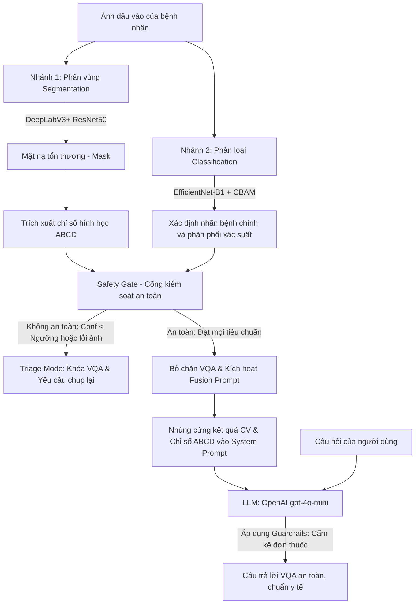

# TÀI LIỆU KHÁI QUÁT KIẾN TRÚC VQA DA LIỄU VÀ KẾ HOẠCH NÂNG CẤP

Tài liệu này đánh giá chi tiết hệ thống Visual Question Answering (VQA) hiện tại của ứng dụng chẩn đoán bệnh da liễu, phân tích luồng xử lý, kiến trúc mô hình xương sống (backbones), các lớp bệnh được hỗ trợ, giao thức dữ liệu Đầu vào/Đầu ra (I/O Specs), và đề xuất kế hoạch nâng cấp tối ưu hơn.

---

## 1. KHÁI QUÁT LUỒNG HOẠT ĐỘNG HIỆN TẠI (CURRENT PIPELINE WORKFLOW)

Hệ thống hiện tại hoạt động theo cơ chế **Hybrid VQA (Kiến trúc Fusion Prompt kết hợp AI cục bộ và LLM Đám mây)**. Thay vì để một mô hình ngôn ngữ tự do phân tích hình ảnh (dễ gây ra hiện tượng ảo giác - hallucination về mặt y khoa), hệ thống chia tách luồng xử lý thành hai nhánh thị giác máy tính (CV) chuyên biệt để trích xuất dữ liệu có cấu trúc đáng tin cậy, sau đó chuyển giao thông tin này cho LLM để hội thoại an toàn.

### Sơ đồ luồng hoạt động (Mermaid Workflow)



### Chi tiết các bước thực thi:
1. **Tiếp nhận ảnh**: Người dùng tải ảnh lên qua giao diện Streamlit.
2. **Nhánh 1 - Phân vùng (Segmentation)**: Mô hình **DeepLabV3+ (ResNet50)** thực hiện khoanh vùng tổn thương da và tạo ra mặt nạ nhị phân (`segmentation_mask`).
3. **Nhánh 2 - Phân loại (Classification)**: Mô hình **EfficientNet-B1 + CBAM Attention** dự đoán phân phối xác suất trên 7 lớp bệnh da liễu.
4. **Trích xuất chỉ số ABCD**: Dựa trên mặt nạ phân vùng, hệ thống tính toán 4 chỉ số hình học lâm sàng:
   - **Area Ratio (A)**: Tỉ lệ diện tích tổn thương trên diện tích ảnh.
   - **Border Complexity (B)**: Độ phức tạp của đường biên tổn thương.
   - **Asymmetry (A)**: Điểm số bất đối xứng (trục ngang/trọc dọc) từ centroid tổn thương $[0, 1]$.
   - **Circularity (C)**: Độ tròn đều của tổn thương $[0, 1]$.
5. **Cổng an toàn (Safety Gate)**: 
   - Kiểm tra xem độ tin cậy phân loại (Confidence) có lớn hơn ngưỡng an toàn $\tau_c$ (mặc định là $0.60$) và các chỉ số hình học có nằm trong giới hạn vật lý bình thường hay không.
   - Nếu vi phạm, hệ thống rơi vào trạng thái `triage`, khóa hoàn toàn tính năng chat VQA và hiển thị cảnh báo từ chối.
   - Nếu thỏa mãn, hệ thống mở khóa VQA Chat Space.
6. **Kiến trúc Fusion Prompt**: 
   - Khi người dùng gửi câu hỏi (ví dụ: *"Bệnh này là bệnh gì?"*), hệ thống sẽ nhúng cứng (hard-code) toàn bộ ngữ cảnh chẩn đoán CV (Nhãn dự đoán cao nhất, phân phối xác suất 7 lớp, và các chỉ số hình học ABCD) vào `system_prompt` của LLM.
   - Điều này ép LLM phải dựa 100% vào dữ liệu thực tế từ các mô hình chuyên biệt, không được tự ý bịa đặt thông tin.
7. **Kích hoạt quy tắc điều hướng y tế (Clinical Guardrails)**:
   - **Quy tắc giải thích bệnh**: Nếu là bệnh lành tính (BKL, NV, DF, VASC), khẳng định lành tính, không lo ung thư, chỉ ảnh hưởng thẩm mỹ hoặc kích ứng tại chỗ, nhưng cảnh báo không được chủ quan nhầm lẫn. Nếu là ác tính hoặc tiền ác tính (AKIEC, BCC, MEL), giải thích thận trọng, nhấn mạnh tầm quan trọng của việc đi khám bác sĩ để làm sinh thiết sớm.
   - **Medication Guardrail (Tuyệt đối cấm kê đơn)**: Nghiêm cấm đưa ra tên thuốc cụ thể (ví dụ: Amoxicillin, Tretinoin...), liều lượng hoặc thời gian dùng thuốc, kể cả trong các câu hỏi giả định.
8. **Gọi LLM & Phản hồi**: OpenAI API (`gpt-4o-mini`) được tích hợp cơ chế **Streaming Response** (`st.write_stream`) để hiển thị câu trả lời dần dần (giống như ChatGPT và Gemini). Sau khi phản hồi hoàn tất, hệ thống tự động gọi `st.rerun()` để đẩy ô đặt câu hỏi (`st.chat_input`) xuống dưới cùng của giao diện chat. Đồng thời, toàn bộ log trao đổi (System prompt, User query, LLM response) được ghi xuống file log cục bộ (`5_Results/system_logs.log`).

---

## 2. KIẾN TRÚC MÔ HÌNH XƯƠNG SỐNG (BACKBONES)

Hệ thống tận dụng các mô hình chuyên biệt cho từng nhiệm vụ:

1. **Phân loại (Classification Backbone)**:
   - **Kiến trúc**: `EfficientNet-B1` kết hợp khối chú ý **CBAM (Convolutional Block Attention Module)** gồm hai nhánh chú ý kênh (Channel Attention) và chú ý không gian (Spatial Attention).
   - **Tác dụng**: Giúp tập trung vào các đặc trưng cục bộ tinh tế của tổn thương da, loại bỏ nhiễu từ các vùng da lành xung quanh.
   - **Tập dữ liệu**: Huấn luyện trên 20,030 ảnh thuộc ISIC, đạt độ chính xác kiểm thử **95.01%** (Accuracy).

2. **Phân vùng (Segmentation Backbone)**:
   - **Kiến trúc**: **DeepLabV3+** với mạng xương sống **ResNet50** làm bộ mã hóa (Encoder).
   - **Tác dụng**: Trích xuất ngữ cảnh đa tỷ lệ nhờ khối Atrous Spatial Pyramid Pooling (ASPP), giúp phân tách biên giới tổn thương cực kỳ chính xác.
   - **Tập dữ liệu**: Huấn luyện trên 2,594 mẫu ảnh phân vùng, đạt chỉ số kiểm thử **Dice = 0.9128** và **IoU = 0.8455**.

3. **Mô hình VQA Cục bộ (Offline VQA Model)**:
   - **Kiến trúc**: `CPUMedicalVQAModel`.
     - Bộ mã hóa hình ảnh (Vision Encoder): `EfficientNet-B1` + `CBAM` (lấy trọng số từ mô hình phân loại được huấn luyện trước).
     - Bộ chuyển đổi đặc trưng (Projection Layer): Mạng tuyến tính gồm 2 lớp MLP với hàm kích hoạt GELU và Dropout, dịch chuyển chiều đặc trưng ảnh từ $1280 \to 768$ (phù hợp với không gian nhúng của mô hình ngôn ngữ).
     - Bộ giải mã văn bản (Language Decoder): **DistilGPT-2** (Causal LM) được tích hợp công nghệ **LoRA** (PEFT) để tinh chỉnh hiệu quả tham số (target lớp `c_attn`).
   - **Dữ liệu huấn luyện**: 74-80 cặp câu hỏi - câu trả lời da liễu tự tạo.
   - **Chỉ số đánh giá (Validation)**: BLEU-1 đạt **0.7269**, BLEU-2 đạt **0.6812**.

---

## 3. CÁC LỚP BỆNH ĐƯỢC HỖ TRỢ (DISEASE CLASSES)

Mô hình phân loại hỗ trợ nhận diện **7 nhóm bệnh lý da liễu chuẩn ISIC** bao gồm cả lành tính, tiền ác tính và ác tính:

| Ký hiệu | Tên Tiếng Anh | Tên Tiếng Việt | Phân loại lâm sàng | Cách LLM ứng xử (Clinical Pathology Rules) |
| :---: | :--- | :--- | :---: | :--- |
| **MEL** | Melanoma | U hắc tố ác tính | **Ác tính** | Giải thích nguy cơ di căn xa, yêu cầu khám gấp để sinh thiết và điều trị y khoa. |
| **BCC** | Basal Cell Carcinoma | Ung thư biểu mô tế bào đáy | **Ác tính** | Giải thích nguy cơ xâm lấn và phá hủy mô tại chỗ, khuyên loại bỏ sớm. |
| **AKIEC** | Actinic Keratosis / Bowen's disease | Dày sừng quang hóa / Tiền ung thư | **Tiền ác tính** | Cảnh báo có khả năng tiến triển thành ung thư tế bào vảy xâm lấn, khuyên đi khám bác sĩ. |
| **BKL** | Benign Keratosis-like lesions | Tổn thương sừng hóa lành tính | **Lành tính** | Khẳng định lành tính, không chuyển ác tính, chỉ ảnh hưởng thẩm mỹ hoặc kích ứng nhẹ. |
| **NV** | Melanocytic nevi | Nốt ruồi lành tính | **Lành tính** | Khẳng định lành tính, hướng dẫn theo dõi định kỳ theo quy tắc ABCDE tại nhà. |
| **DF** | Dermatofibroma | U xơ da | **Lành tính** | Khẳng định lành tính, giải thích đây là các u sợi dưới da không nguy hại sức khỏe. |
| **VASC** | Vascular lesions | Tổn thương mạch máu | **Lành tính** | Khẳng định lành tính, giải thích liên quan đến sự giãn nở mạch máu (cherry angioma...). |

---

## 4. CHI TIẾT DỮ LIỆU ĐẦU VÀO VÀ ĐẦU RA (PROGRAM I/O SPECS)

Để tích hợp hoặc kiểm thử chương trình, giao thức truyền thông điệp của Pipeline và Module VQA được chuẩn hóa như sau:

### A. Đầu vào (Inputs)
Hệ thống tiếp nhận các tham số đầu vào qua giao diện hoặc CLI:
* `image_path` (str): Đường dẫn tuyệt đối hoặc tương đối tới tệp ảnh da liễu đầu vào (`.png`, `.jpg`, `.jpeg`).
* `question` (str): Câu hỏi ngôn ngữ tự nhiên từ người dùng (ví dụ: *"Bệnh này có lây không?"*, *"Bệnh này gây hậu quả gì?"*).
* `min_conf` (float): Ngưỡng an toàn phân loại $\tau_c \in [0.30, 0.95]$ (Mặc định: `0.60`).
* `history` (list[dict]): Lịch sử hội thoại chat cũ dạng `[{"role": "user", "content": "..."}, {"role": "assistant", "content": "..."}]` để duy trì ngữ cảnh trò chuyện nhiều lượt.

### B. Đầu ra (Outputs)
Sau khi thực thi, Pipeline trả về một Dictionary có dạng:

```json
{
  "status": "ok | triage",
  "image_path": "d:\\DoAn_DaLieu\\input.png",
  "triage_reason": null, // Nếu status là triage, chứa mã lỗi (ví dụ: "low_classification_confidence")
  "preprocess": {
    "image_type": "phone | dermoscopy",
    "preset": "raw_rgb"
  },
  "segmentation": {
    "method": "deeplab | classical_fallback",
    "threshold": 0.3,
    "lesion_found": 1
  },
  "segmentation_mask": "np.ndarray (H, W) - giá trị 0 hoặc 1",
  "metrics": {
    "area_ratio": 0.0435,
    "border_complexity": 3.821,
    "asymmetry": 0.2104,
    "circularity": 0.8123,
    "lesion_area": 2560,
    "image_area": 58880,
    "low_confidence": false
  },
  "classification": {
    "prediction": "BKL",
    "confidence": 0.9662,
    "probabilities": {
      "AKIEC": 0.0012,
      "BCC": 0.0054,
      "BKL": 0.9662,
      "DF": 0.0021,
      "MEL": 0.0081,
      "NV": 0.0152,
      "VASC": 0.0018
    }
  },
  "report": "Dermatology Report\n- Risk level: LOW RISK\n- Area ratio: 0.0435\n- Border complexity: 3.821\n- Classification: BKL (conf=0.97)\nRecommendation: confirm with dermatologist."
}
```

Phản hồi chat VQA cuối cùng trả về chuỗi văn bản (String) dạng Markdown Tiếng Việt, tối đa 400 từ và luôn tuân thủ nghiêm ngặt các quy tắc an toàn y đức.

---

## 5. ĐÁNH GIÁ HỆ THỐNG VQA HIỆN TẠI (CRITICAL EVALUATION)

### A. Ưu điểm (Strengths)
1. **Kiểm soát thông tin tuyệt đối (No Hallucination)**: LLM đám mây không thể tự do sáng tạo chẩn đoán bừa bãi nhờ cơ chế nhúng cứng kết quả phân tích CV chuyên biệt vào cấu trúc System Prompt.
2. **An toàn y tế vượt trội**: Cổng Safety Gate ngăn chặn kịp thời các trường hợp ảnh chất lượng kém, hoặc mô hình phân loại bị phân vân (độ tin cậy thấp). Medication Guardrail ngăn cản hoàn toàn nguy cơ LLM kê đơn thuốc hoặc biệt dược trái phép.
3. **Phản hồi linh hoạt theo phân loại bệnh lý**: Khác biệt rõ ràng trong cách hành xử giữa bệnh lành tính (giảm lo âu cho bệnh nhân) và ác tính (thúc giục đi khám cấp thiết).
4. **Hỗ trợ EHR tích hợp**: Lưu trữ lịch sử khám bệnh qua nhiều mốc thời gian trên Cloud Firestore và lưu trữ đồ thị phân phối xác suất lâm sàng phục vụ công tác tra cứu của bác sĩ.

### B. Hạn chế (Weaknesses)
1. **Sự phụ thuộc vào OpenAI Cloud**: Luồng VQA trong Web App hoạt động tốt nhờ gọi API của OpenAI. Điều này yêu cầu kết nối Internet liên tục và phát sinh chi phí vận hành API.
2. **Mô hình VQA Cục bộ (`CPUMedicalVQAModel`) quá yếu**:
   - Sử dụng **DistilGPT-2** (chỉ 82M tham số), năng lực hiểu ngôn ngữ tự nhiên còn thô sơ. Thường gặp lỗi lặp từ, hoặc sinh văn bản không mạch lạc khi hỏi các câu phức tạp.
   - Tập dữ liệu VQA offline quá nhỏ (chỉ 74-80 QA cặp), khiến mô hình VQA cục bộ chưa có khả năng khái quát hóa sang các bệnh lý khác ngoài tập huấn luyện.
   - Chỉ số đánh giá BLEU-1/2 chỉ thể hiện mức độ trùng khớp từ ngữ với câu trả lời mẫu, chưa thực sự đánh giá được tính chính xác về kiến thức y khoa của câu trả lời.

---

## 6. KẾ HOẠCH NÂNG CẤP VÀ SỬA CHỮA (IMPROVEMENT PLAN)

Để đưa hệ thống VQA đạt chuẩn chuyên nghiệp hơn, chúng tôi đề xuất kế hoạch nâng cấp gồm 2 giai đoạn:

### Giai đoạn 1: Nâng cấp ngắn hạn (VQA Cải tiến ứng dụng thực tế)

1. **Thay thế DistilGPT-2 bằng một SLM (Small Language Model) hiện đại ngoại tuyến**:
   - Thay vì DistilGPT-2, sử dụng các mô hình nhỏ nhưng cực kỳ mạnh mẽ như **Phi-3-mini-4B-Instruct** (Microsoft), **Qwen2.5-1.5B/3B-Instruct** hoặc **Llama-3-8B-Instruct** (Meta).
   - Tinh chỉnh mô hình bằng phương pháp **QLoRA (Quantized LoRA)** với mức lượng hóa 4-bit để mô hình có thể chạy mượt mà ngay trên các máy tính cá nhân hoặc máy chủ CPU thông thường mà không cần GPU đắt đỏ.

2. **Áp dụng RAG (Retrieval-Augmented Generation) y học da liễu**:
   - Xây dựng một cơ sở dữ liệu tri thức đáng tin cậy về 7 loại bệnh da liễu từ các nguồn uy tín (MSD Manuals, DermNet, WHO).
   - Khi người dùng hỏi một câu hỏi y khoa phức tạp, hệ thống sẽ sử dụng công nghệ tìm kiếm ngữ nghĩa (Semantic Search) để truy xuất các đoạn tài liệu tương ứng, sau đó nhúng kèm vào prompt của LLM cùng kết quả CV. Điều này giúp câu trả lời của mô hình ngôn ngữ vừa sâu sắc vừa an toàn tuyệt đối.

3. **Mở rộng bộ dữ liệu VQA chuyên sâu**:
   - Mở rộng tập dữ liệu huấn luyện VQA cục bộ từ 74 cặp câu hỏi lên trên **1,000+** cặp câu hỏi đa dạng bằng cách sử dụng các mô hình ngôn ngữ lớn để tổng hợp tự động từ hồ sơ bệnh án ISIC (sau đó có sự thẩm định của bác sĩ chuyên khoa).

### Giai đoạn 2: Nâng cấp dài hạn (Kiến trúc End-to-End VLM)

1. **Fine-tune mô hình đa phương thức đầu-cuối (Vision-Language Models - VLMs)**:
   - Nghiên cứu và huấn luyện chuyển giao trên các kiến trúc VLM mã nguồn mở có kích thước vừa phải như **PaliGemma (3B)** của Google hoặc **LLaVA-Med** chuyên sâu về y tế.
   - Các mô hình này có khả năng tiếp nhận trực tiếp ảnh tổn thương da mà không cần qua hai nhánh phân tách rời rạc, giúp mô hình tự nhận diện được cả cấu trúc hình ảnh và văn bản để đưa ra chẩn đoán tích hợp tự nhiên nhất.
